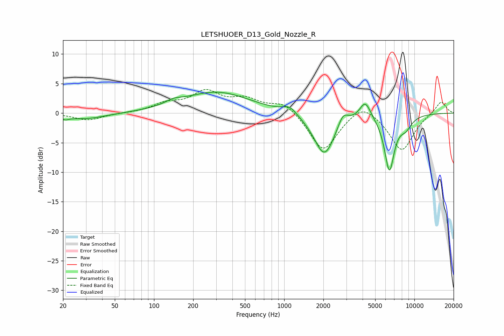

# LETSHUOER_D13_Gold_Nozzle_R
See [usage instructions](https://github.com/jaakkopasanen/AutoEq#usage) for more options and info.

### Parametric EQs
Apply preamp of -3.6 dB when using parametric equalizer.

|   # | Type    |   Fc (Hz) |    Q |   Gain (dB) |
|-----|---------|-----------|------|-------------|
|   1 | Peaking |        21 | 5.6  |        -0.5 |
|   2 | Peaking |        29 | 0.88 |        -1   |
|   3 | Peaking |       142 | 2.31 |         0.7 |
|   4 | Peaking |       302 | 0.55 |         3.6 |
|   5 | Peaking |      1104 | 2.61 |         1.3 |
|   6 | Peaking |      2035 | 1.75 |        -7.2 |
|   7 | Peaking |      2829 | 3.67 |         2.1 |
|   8 | Peaking |      4192 | 3.31 |         3   |
|   9 | Peaking |      6425 | 3.54 |        -9.4 |
|  10 | Peaking |      8571 | 2.74 |        -1.8 |

### Fixed Band EQs
When using fixed band (also called graphic) equalizer, apply preamp of **-4.1 dB** (if available) and set gains manually with these parameters.

|   # | Type    |   Fc (Hz) |    Q |   Gain (dB) |
|-----|---------|-----------|------|-------------|
|   1 | Peaking |        31 | 1.41 |        -1.2 |
|   2 | Peaking |        62 | 1.41 |        -0   |
|   3 | Peaking |       125 | 1.41 |         1.4 |
|   4 | Peaking |       250 | 1.41 |         3.4 |
|   5 | Peaking |       500 | 1.41 |         2.1 |
|   6 | Peaking |      1000 | 1.41 |         2   |
|   7 | Peaking |      2000 | 1.41 |        -6.6 |
|   8 | Peaking |      4000 | 1.41 |         2.2 |
|   9 | Peaking |      8000 | 1.41 |        -6.4 |
|  10 | Peaking |     16000 | 1.41 |         2.2 |

### Graphs

