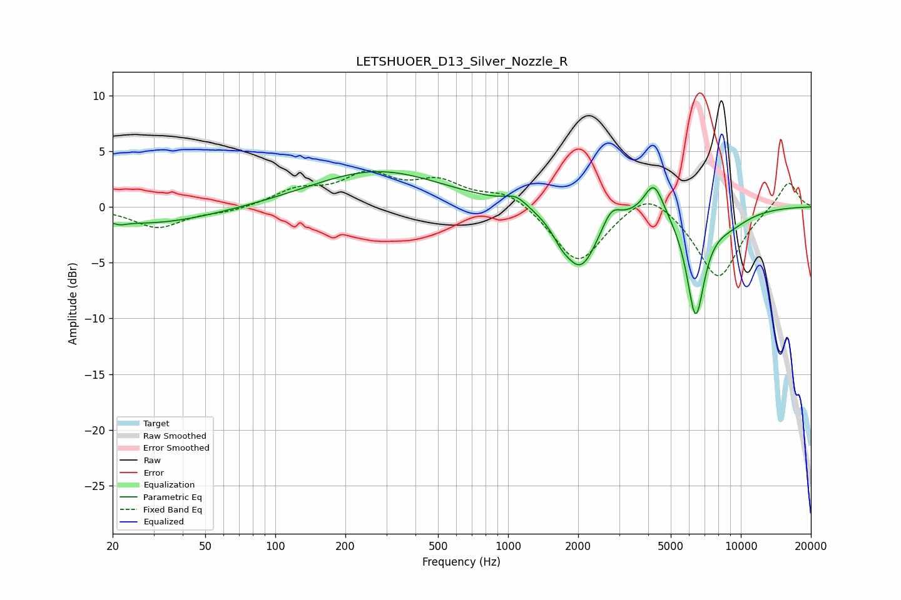

# LETSHUOER_D13_Silver_Nozzle_R
See [usage instructions](https://github.com/jaakkopasanen/AutoEq#usage) for more options and info.

### Parametric EQs
Apply preamp of -3.3 dB when using parametric equalizer.

|   # | Type    |   Fc (Hz) |    Q |   Gain (dB) |
|-----|---------|-----------|------|-------------|
|   1 | Peaking |        21 | 5.11 |        -0.3 |
|   2 | Peaking |        29 | 0.5  |        -1.5 |
|   3 | Peaking |       273 | 0.5  |         3.2 |
|   4 | Peaking |      1082 | 2.9  |         0.9 |
|   5 | Peaking |      1693 | 3.76 |        -0.9 |
|   6 | Peaking |      2051 | 1.9  |        -5.4 |
|   7 | Peaking |      2778 | 3.66 |         1.6 |
|   8 | Peaking |      4234 | 3.33 |         3.1 |
|   9 | Peaking |      6394 | 3.5  |        -9.2 |
|  10 | Peaking |      8832 | 1.33 |        -1.2 |

### Fixed Band EQs
When using fixed band (also called graphic) equalizer, apply preamp of **-3.3 dB** (if available) and set gains manually with these parameters.

|   # | Type    |   Fc (Hz) |    Q |   Gain (dB) |
|-----|---------|-----------|------|-------------|
|   1 | Peaking |        31 | 1.41 |        -1.9 |
|   2 | Peaking |        62 | 1.41 |        -0.4 |
|   3 | Peaking |       125 | 1.41 |         1.4 |
|   4 | Peaking |       250 | 1.41 |         2.6 |
|   5 | Peaking |       500 | 1.41 |         2   |
|   6 | Peaking |      1000 | 1.41 |         1.4 |
|   7 | Peaking |      2000 | 1.41 |        -5.2 |
|   8 | Peaking |      4000 | 1.41 |         2.1 |
|   9 | Peaking |      8000 | 1.41 |        -6.5 |
|  10 | Peaking |     16000 | 1.41 |         2.4 |

### Graphs

