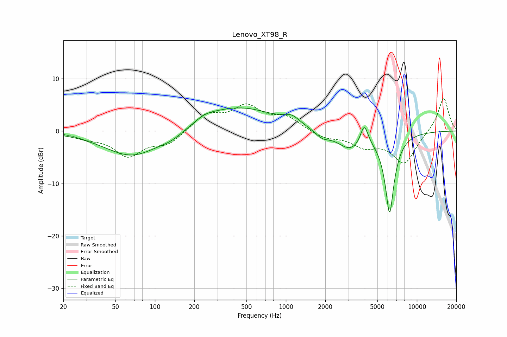

# Lenovo_XT98_R
See [usage instructions](https://github.com/jaakkopasanen/AutoEq#usage) for more options and info.

### Parametric EQs
Apply preamp of -4.5 dB when using parametric equalizer.

|   # | Type    |   Fc (Hz) |    Q |   Gain (dB) |
|-----|---------|-----------|------|-------------|
|   1 | Peaking |        67 | 0.67 |        -4.8 |
|   2 | Peaking |       135 | 1.51 |        -1   |
|   3 | Peaking |       241 | 1.74 |         0.9 |
|   4 | Peaking |       272 | 0.89 |         0.1 |
|   5 | Peaking |       438 | 0.51 |         4.5 |
|   6 | Peaking |      1108 | 2.32 |         1.4 |
|   7 | Peaking |      1893 | 2.57 |        -1.3 |
|   8 | Peaking |      3098 | 1.45 |        -3.3 |
|   9 | Peaking |      3968 | 4.75 |         4   |
|  10 | Peaking |      6192 | 3.82 |       -15.3 |

### Fixed Band EQs
When using fixed band (also called graphic) equalizer, apply preamp of **-6.3 dB** (if available) and set gains manually with these parameters.

|   # | Type    |   Fc (Hz) |    Q |   Gain (dB) |
|-----|---------|-----------|------|-------------|
|   1 | Peaking |        31 | 1.41 |        -1   |
|   2 | Peaking |        62 | 1.41 |        -4.5 |
|   3 | Peaking |       125 | 1.41 |        -2.4 |
|   4 | Peaking |       250 | 1.41 |         3.1 |
|   5 | Peaking |       500 | 1.41 |         4.3 |
|   6 | Peaking |      1000 | 1.41 |         2.4 |
|   7 | Peaking |      2000 | 1.41 |        -1.3 |
|   8 | Peaking |      4000 | 1.41 |        -2.6 |
|   9 | Peaking |      8000 | 1.41 |        -6.1 |
|  10 | Peaking |     16000 | 1.41 |         6.5 |

### Graphs

