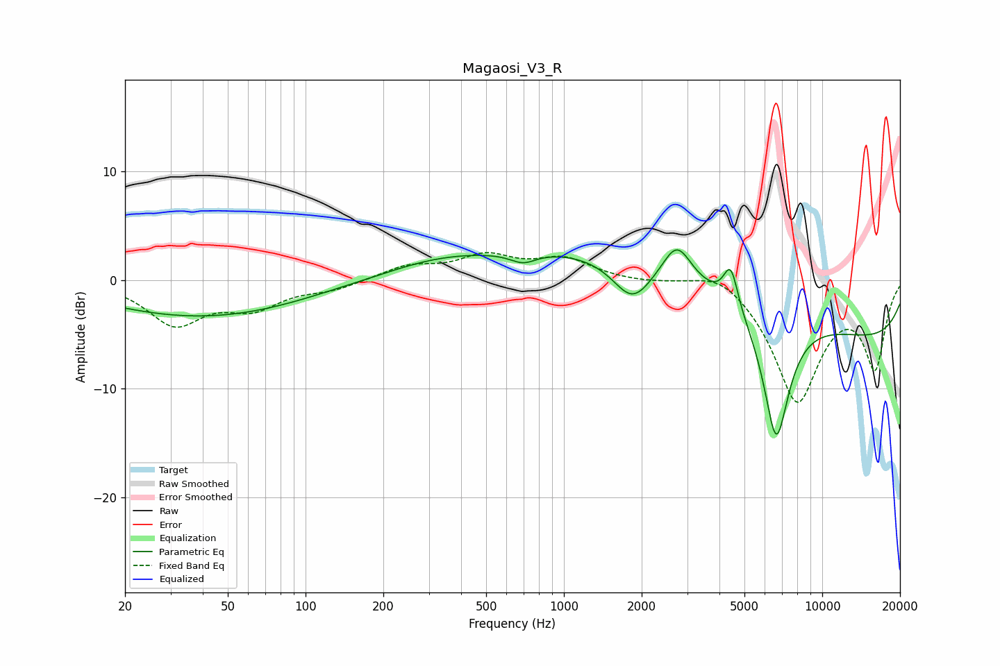

# Magaosi_V3_R
See [usage instructions](https://github.com/jaakkopasanen/AutoEq#usage) for more options and info.

### Parametric EQs
Apply preamp of -2.9 dB when using parametric equalizer.

|   # | Type    |   Fc (Hz) |    Q |   Gain (dB) |
|-----|---------|-----------|------|-------------|
|   1 | Peaking |        30 | 0.44 |        -2.5 |
|   2 | Peaking |        70 | 0.52 |        -1.3 |
|   3 | Peaking |       327 | 0.65 |         1.4 |
|   4 | Peaking |       695 | 2.78 |        -1   |
|   5 | Peaking |      1841 | 1.88 |        -3.6 |
|   6 | Peaking |      2741 | 2.53 |         3.6 |
|   7 | Peaking |      2885 | 0.21 |         4.7 |
|   8 | Peaking |      4426 | 5    |         3.8 |
|   9 | Peaking |      6634 | 2.58 |       -12.1 |
|  10 | Peaking |     10000 | 0.18 |        -6.5 |

### Fixed Band EQs
When using fixed band (also called graphic) equalizer, apply preamp of **-2.6 dB** (if available) and set gains manually with these parameters.

|   # | Type    |   Fc (Hz) |    Q |   Gain (dB) |
|-----|---------|-----------|------|-------------|
|   1 | Peaking |        31 | 1.41 |        -3.9 |
|   2 | Peaking |        62 | 1.41 |        -2.2 |
|   3 | Peaking |       125 | 1.41 |        -0.8 |
|   4 | Peaking |       250 | 1.41 |         1.2 |
|   5 | Peaking |       500 | 1.41 |         2   |
|   6 | Peaking |      1000 | 1.41 |         1.9 |
|   7 | Peaking |      2000 | 1.41 |        -0.2 |
|   8 | Peaking |      4000 | 1.41 |         1.5 |
|   9 | Peaking |      8000 | 1.41 |       -11   |
|  10 | Peaking |     16000 | 1.41 |        -7.7 |

### Graphs

