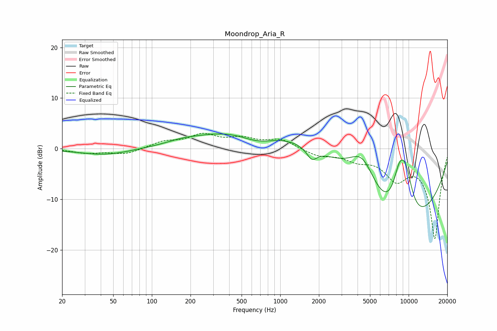

# Moondrop_Aria_R
See [usage instructions](https://github.com/jaakkopasanen/AutoEq#usage) for more options and info.

### Parametric EQs
Apply preamp of -3.0 dB when using parametric equalizer.

|   # | Type    |   Fc (Hz) |    Q |   Gain (dB) |
|-----|---------|-----------|------|-------------|
|   1 | Peaking |        43 | 0.71 |        -1.3 |
|   2 | Peaking |       172 | 1.38 |         0.4 |
|   3 | Peaking |       669 | 0.94 |        -2.6 |
|   4 | Peaking |      1068 | 0.22 |         5.8 |
|   5 | Peaking |      1761 | 3.59 |        -1.1 |
|   6 | Peaking |      1764 | 3.41 |        -1.1 |
|   7 | Peaking |      4366 | 1.28 |         7.3 |
|   8 | Peaking |      8428 | 0.35 |       -20   |
|   9 | Peaking |      8471 | 2.21 |         8.8 |
|  10 | Peaking |      9529 | 2.1  |         8.5 |

### Fixed Band EQs
When using fixed band (also called graphic) equalizer, apply preamp of **-3.2 dB** (if available) and set gains manually with these parameters.

|   # | Type    |   Fc (Hz) |    Q |   Gain (dB) |
|-----|---------|-----------|------|-------------|
|   1 | Peaking |        31 | 1.41 |        -0.8 |
|   2 | Peaking |        62 | 1.41 |        -1.1 |
|   3 | Peaking |       125 | 1.41 |         1.3 |
|   4 | Peaking |       250 | 1.41 |         2.5 |
|   5 | Peaking |       500 | 1.41 |         1.7 |
|   6 | Peaking |      1000 | 1.41 |         1.8 |
|   7 | Peaking |      2000 | 1.41 |        -1.3 |
|   8 | Peaking |      4000 | 1.41 |        -1.8 |
|   9 | Peaking |      8000 | 1.41 |        -5.1 |
|  10 | Peaking |     16000 | 1.41 |       -17.6 |

### Graphs

