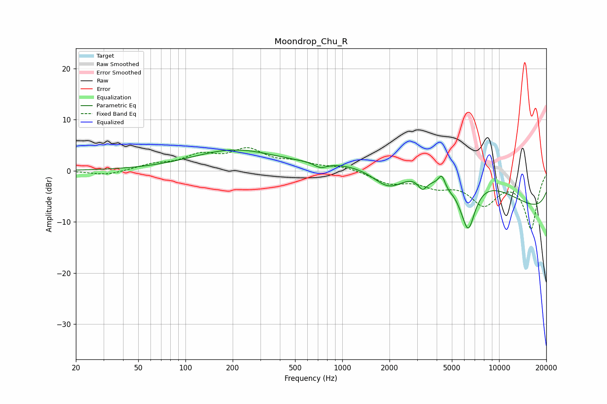

# Moondrop_Chu_R
See [usage instructions](https://github.com/jaakkopasanen/AutoEq#usage) for more options and info.

### Parametric EQs
Apply preamp of -4.1 dB when using parametric equalizer.

|   # | Type    |   Fc (Hz) |    Q |   Gain (dB) |
|-----|---------|-----------|------|-------------|
|   1 | Peaking |       203 | 0.53 |         3.9 |
|   2 | Peaking |       726 | 3.4  |        -1.1 |
|   3 | Peaking |      1987 | 1.27 |        -4.9 |
|   4 | Peaking |      3251 | 4.77 |        -2.4 |
|   5 | Peaking |      4317 | 5.99 |         2.9 |
|   6 | Peaking |      4803 | 1.37 |        -4.5 |
|   7 | Peaking |      5118 | 4.13 |         0.8 |
|   8 | Peaking |      5566 | 0.27 |        14.1 |
|   9 | Peaking |      6354 | 2.9  |        -9.4 |
|  10 | Peaking |     10000 | 0.18 |       -14.1 |

### Fixed Band EQs
When using fixed band (also called graphic) equalizer, apply preamp of **-4.6 dB** (if available) and set gains manually with these parameters.

|   # | Type    |   Fc (Hz) |    Q |   Gain (dB) |
|-----|---------|-----------|------|-------------|
|   1 | Peaking |        31 | 1.41 |        -0.9 |
|   2 | Peaking |        62 | 1.41 |         1.1 |
|   3 | Peaking |       125 | 1.41 |         2.7 |
|   4 | Peaking |       250 | 1.41 |         3.7 |
|   5 | Peaking |       500 | 1.41 |         1.3 |
|   6 | Peaking |      1000 | 1.41 |         0.8 |
|   7 | Peaking |      2000 | 1.41 |        -2.2 |
|   8 | Peaking |      4000 | 1.41 |        -2.4 |
|   9 | Peaking |      8000 | 1.41 |        -5.9 |
|  10 | Peaking |     16000 | 1.41 |       -11.1 |

### Graphs

