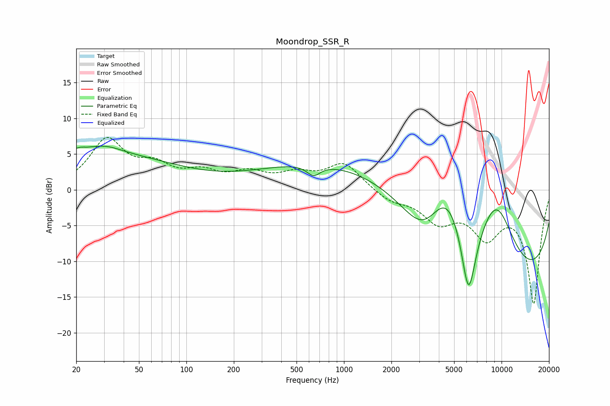

# Moondrop_SSR_R
See [usage instructions](https://github.com/jaakkopasanen/AutoEq#usage) for more options and info.

### Parametric EQs
Apply preamp of -6.2 dB when using parametric equalizer.

|   # | Type    |   Fc (Hz) |    Q |   Gain (dB) |
|-----|---------|-----------|------|-------------|
|   1 | Peaking |        20 | 0.21 |         5.3 |
|   2 | Peaking |        21 | 5.55 |         0.2 |
|   3 | Peaking |        31 | 1.43 |         0.9 |
|   4 | Peaking |       642 | 3.3  |        -1.5 |
|   5 | Peaking |      1592 | 0.18 |         5.1 |
|   6 | Peaking |      3260 | 0.8  |       -10.7 |
|   7 | Peaking |      4553 | 0.6  |        16.7 |
|   8 | Peaking |      6170 | 2.29 |       -14.5 |
|   9 | Peaking |      9288 | 1.04 |         8.6 |
|  10 | Peaking |      9667 | 0.21 |       -16.5 |

### Fixed Band EQs
When using fixed band (also called graphic) equalizer, apply preamp of **-7.4 dB** (if available) and set gains manually with these parameters.

|   # | Type    |   Fc (Hz) |    Q |   Gain (dB) |
|-----|---------|-----------|------|-------------|
|   1 | Peaking |        31 | 1.41 |         6.7 |
|   2 | Peaking |        62 | 1.41 |         2.7 |
|   3 | Peaking |       125 | 1.41 |         2   |
|   4 | Peaking |       250 | 1.41 |         2   |
|   5 | Peaking |       500 | 1.41 |         1.8 |
|   6 | Peaking |      1000 | 1.41 |         3.6 |
|   7 | Peaking |      2000 | 1.41 |        -1.4 |
|   8 | Peaking |      4000 | 1.41 |        -4   |
|   9 | Peaking |      8000 | 1.41 |        -5.7 |
|  10 | Peaking |     16000 | 1.41 |       -15.7 |

### Graphs

