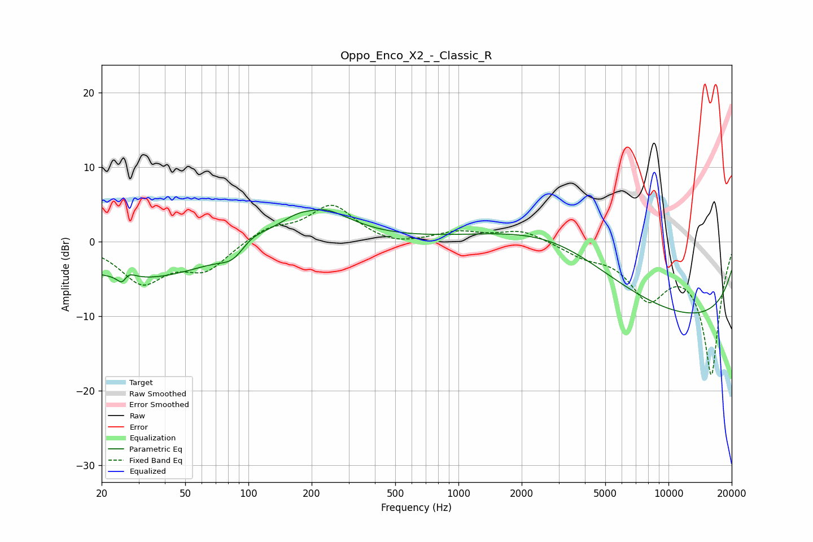

# Oppo_Enco_X2_-_Classic_R
See [usage instructions](https://github.com/jaakkopasanen/AutoEq#usage) for more options and info.

### Parametric EQs
Apply preamp of -4.4 dB when using parametric equalizer.

|   # | Type    |   Fc (Hz) |    Q |   Gain (dB) |
|-----|---------|-----------|------|-------------|
|   1 | Peaking |        25 | 5.29 |        -4.5 |
|   2 | Peaking |        26 | 4.58 |         4.1 |
|   3 | Peaking |        30 | 0.4  |        -5.1 |
|   4 | Peaking |        84 | 2.34 |        -1.6 |
|   5 | Peaking |        93 | 2.62 |        -0.2 |
|   6 | Peaking |       102 | 2.13 |         1.4 |
|   7 | Peaking |       200 | 2.42 |        -0.8 |
|   8 | Peaking |       203 | 0.95 |         5.6 |
|   9 | Peaking |      2977 | 0.44 |         6.7 |
|  10 | Peaking |     10000 | 0.18 |       -10.8 |

### Fixed Band EQs
When using fixed band (also called graphic) equalizer, apply preamp of **-5.0 dB** (if available) and set gains manually with these parameters.

|   # | Type    |   Fc (Hz) |    Q |   Gain (dB) |
|-----|---------|-----------|------|-------------|
|   1 | Peaking |        31 | 1.41 |        -5.3 |
|   2 | Peaking |        62 | 1.41 |        -3.6 |
|   3 | Peaking |       125 | 1.41 |         1.8 |
|   4 | Peaking |       250 | 1.41 |         4.8 |
|   5 | Peaking |       500 | 1.41 |        -0.8 |
|   6 | Peaking |      1000 | 1.41 |         1.2 |
|   7 | Peaking |      2000 | 1.41 |         1.6 |
|   8 | Peaking |      4000 | 1.41 |        -1.5 |
|   9 | Peaking |      8000 | 1.41 |        -6.6 |
|  10 | Peaking |     16000 | 1.41 |       -17.7 |

### Graphs

