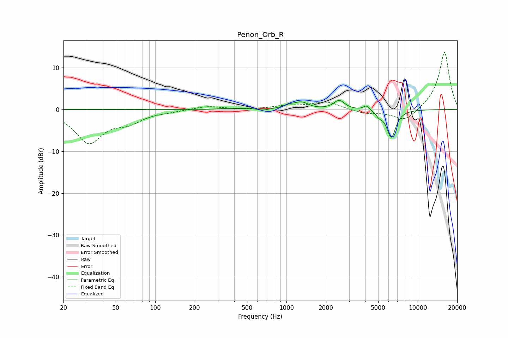

# Penon_Orb_R
See [usage instructions](https://github.com/jaakkopasanen/AutoEq#usage) for more options and info.

### Parametric EQs
Apply preamp of -2.3 dB when using parametric equalizer.

|   # | Type    |   Fc (Hz) |    Q |   Gain (dB) |
|-----|---------|-----------|------|-------------|
|   1 | Peaking |       355 | 2.68 |         0.2 |
|   2 | Peaking |       603 | 1.45 |         0.3 |
|   3 | Peaking |       659 | 3.24 |        -0.6 |
|   4 | Peaking |      1045 | 3.87 |         0.5 |
|   5 | Peaking |      1308 | 2.33 |         1.8 |
|   6 | Peaking |      1529 | 1.99 |        -0.3 |
|   7 | Peaking |      2524 | 3.54 |         2.1 |
|   8 | Peaking |      4077 | 6    |         1.2 |
|   9 | Peaking |      5084 | 6    |        -1   |
|  10 | Peaking |      6294 | 3.95 |        -6.7 |

### Fixed Band EQs
When using fixed band (also called graphic) equalizer, apply preamp of **-13.8 dB** (if available) and set gains manually with these parameters.

|   # | Type    |   Fc (Hz) |    Q |   Gain (dB) |
|-----|---------|-----------|------|-------------|
|   1 | Peaking |        31 | 1.41 |        -7.7 |
|   2 | Peaking |        62 | 1.41 |        -2.5 |
|   3 | Peaking |       125 | 1.41 |        -0.3 |
|   4 | Peaking |       250 | 1.41 |         0.8 |
|   5 | Peaking |       500 | 1.41 |        -0.1 |
|   6 | Peaking |      1000 | 1.41 |         0.8 |
|   7 | Peaking |      2000 | 1.41 |         1.8 |
|   8 | Peaking |      4000 | 1.41 |        -1   |
|   9 | Peaking |      8000 | 1.41 |        -3   |
|  10 | Peaking |     16000 | 1.41 |        13.9 |

### Graphs

