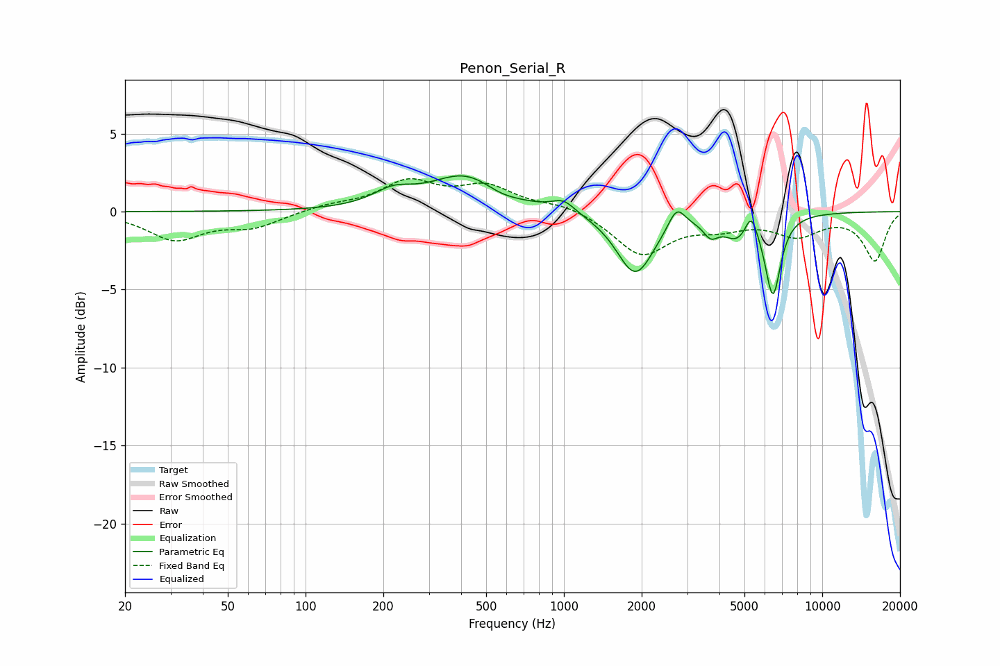

# Penon_Serial_R
See [usage instructions](https://github.com/jaakkopasanen/AutoEq#usage) for more options and info.

### Parametric EQs
Apply preamp of -2.4 dB when using parametric equalizer.

|   # | Type    |   Fc (Hz) |    Q |   Gain (dB) |
|-----|---------|-----------|------|-------------|
|   1 | Peaking |       218 | 1.81 |         0.9 |
|   2 | Peaking |       417 | 1.03 |         2.3 |
|   3 | Peaking |       567 | 2.05 |        -0.4 |
|   4 | Peaking |       996 | 3.16 |         0.7 |
|   5 | Peaking |      1890 | 1.96 |        -4   |
|   6 | Peaking |      2731 | 4.4  |         1.4 |
|   7 | Peaking |      3700 | 4.92 |        -0.9 |
|   8 | Peaking |      4678 | 2.66 |        -1.4 |
|   9 | Peaking |      5309 | 6    |         1.5 |
|  10 | Peaking |      6441 | 4.59 |        -5.1 |

### Fixed Band EQs
When using fixed band (also called graphic) equalizer, apply preamp of **-2.2 dB** (if available) and set gains manually with these parameters.

|   # | Type    |   Fc (Hz) |    Q |   Gain (dB) |
|-----|---------|-----------|------|-------------|
|   1 | Peaking |        31 | 1.41 |        -1.7 |
|   2 | Peaking |        62 | 1.41 |        -0.9 |
|   3 | Peaking |       125 | 1.41 |         0.4 |
|   4 | Peaking |       250 | 1.41 |         1.8 |
|   5 | Peaking |       500 | 1.41 |         1.5 |
|   6 | Peaking |      1000 | 1.41 |         0.5 |
|   7 | Peaking |      2000 | 1.41 |        -2.7 |
|   8 | Peaking |      4000 | 1.41 |        -0.8 |
|   9 | Peaking |      8000 | 1.41 |        -1.4 |
|  10 | Peaking |     16000 | 1.41 |        -3.1 |

### Graphs

