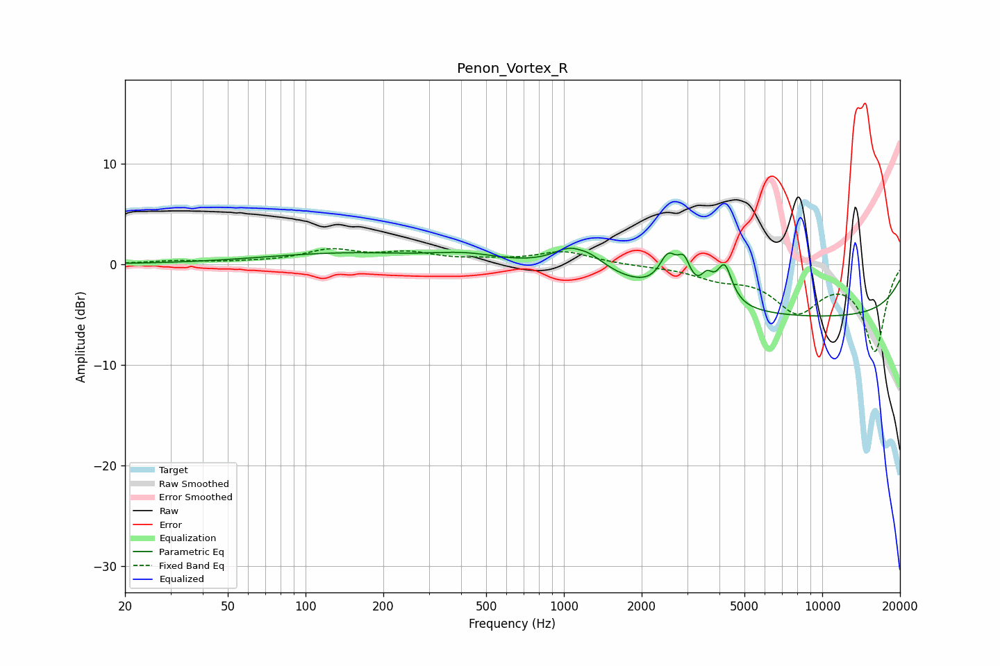

# Penon_Vortex_R
See [usage instructions](https://github.com/jaakkopasanen/AutoEq#usage) for more options and info.

### Parametric EQs
Apply preamp of -1.7 dB when using parametric equalizer.

|   # | Type    |   Fc (Hz) |    Q |   Gain (dB) |
|-----|---------|-----------|------|-------------|
|   1 | Peaking |       102 | 1.13 |        -0   |
|   2 | Peaking |       140 | 0.46 |         1.1 |
|   3 | Peaking |       418 | 1.09 |         0.8 |
|   4 | Peaking |      1137 | 1.89 |         3.5 |
|   5 | Peaking |      1146 | 3.38 |        -0.9 |
|   6 | Peaking |      2532 | 4.16 |         3.2 |
|   7 | Peaking |      2916 | 5.7  |         2.6 |
|   8 | Peaking |      3584 | 5.95 |         1.7 |
|   9 | Peaking |      4190 | 4.89 |         3.7 |
|  10 | Peaking |      9261 | 0.18 |        -5.2 |

### Fixed Band EQs
When using fixed band (also called graphic) equalizer, apply preamp of **-1.7 dB** (if available) and set gains manually with these parameters.

|   # | Type    |   Fc (Hz) |    Q |   Gain (dB) |
|-----|---------|-----------|------|-------------|
|   1 | Peaking |        31 | 1.41 |         0.3 |
|   2 | Peaking |        62 | 1.41 |         0.1 |
|   3 | Peaking |       125 | 1.41 |         1.3 |
|   4 | Peaking |       250 | 1.41 |         1   |
|   5 | Peaking |       500 | 1.41 |         0.3 |
|   6 | Peaking |      1000 | 1.41 |         1.2 |
|   7 | Peaking |      2000 | 1.41 |        -0.1 |
|   8 | Peaking |      4000 | 1.41 |        -1.1 |
|   9 | Peaking |      8000 | 1.41 |        -4.3 |
|  10 | Peaking |     16000 | 1.41 |        -8.5 |

### Graphs

