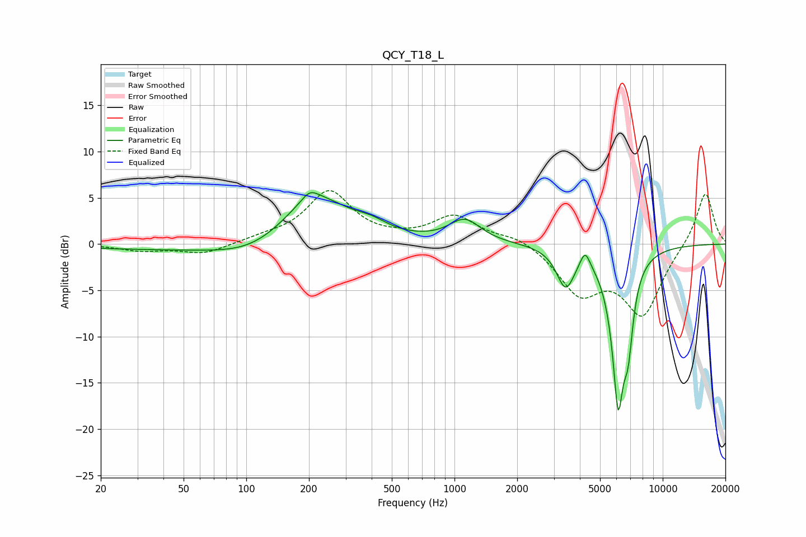

# QCY_T18_L
See [usage instructions](https://github.com/jaakkopasanen/AutoEq#usage) for more options and info.

### Parametric EQs
Apply preamp of -5.7 dB when using parametric equalizer.

|   # | Type    |   Fc (Hz) |    Q |   Gain (dB) |
|-----|---------|-----------|------|-------------|
|   1 | Peaking |        35 | 0.36 |        -0.5 |
|   2 | Peaking |       112 | 0.75 |        -1.9 |
|   3 | Peaking |       202 | 3.74 |         1   |
|   4 | Peaking |       211 | 0.82 |         5.6 |
|   5 | Peaking |       400 | 1.93 |         0.8 |
|   6 | Peaking |      1121 | 1.87 |         2.5 |
|   7 | Peaking |      3416 | 3.28 |        -4.2 |
|   8 | Peaking |      4236 | 5.99 |         1.9 |
|   9 | Peaking |      6111 | 4.37 |       -16.1 |
|  10 | Peaking |      6829 | 5.9  |        -5.9 |

### Fixed Band EQs
When using fixed band (also called graphic) equalizer, apply preamp of **-5.9 dB** (if available) and set gains manually with these parameters.

|   # | Type    |   Fc (Hz) |    Q |   Gain (dB) |
|-----|---------|-----------|------|-------------|
|   1 | Peaking |        31 | 1.41 |        -0.7 |
|   2 | Peaking |        62 | 1.41 |        -1.1 |
|   3 | Peaking |       125 | 1.41 |         0.5 |
|   4 | Peaking |       250 | 1.41 |         5.6 |
|   5 | Peaking |       500 | 1.41 |         0.3 |
|   6 | Peaking |      1000 | 1.41 |         2.9 |
|   7 | Peaking |      2000 | 1.41 |         0.9 |
|   8 | Peaking |      4000 | 1.41 |        -5   |
|   9 | Peaking |      8000 | 1.41 |        -7.4 |
|  10 | Peaking |     16000 | 1.41 |         5.9 |

### Graphs

