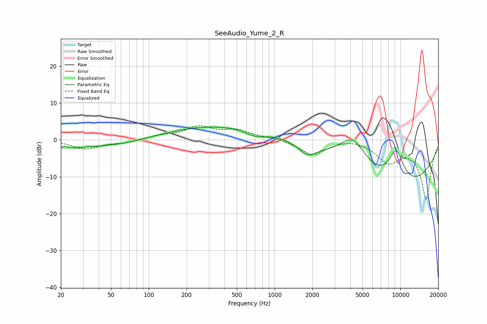

# SeeAudio_Yume_2_R
See [usage instructions](https://github.com/jaakkopasanen/AutoEq#usage) for more options and info.

### Parametric EQs
Apply preamp of -3.6 dB when using parametric equalizer.

|   # | Type    |   Fc (Hz) |    Q |   Gain (dB) |
|-----|---------|-----------|------|-------------|
|   1 | Peaking |        20 | 1.3  |        -1.8 |
|   2 | Peaking |        21 | 5.91 |        -1.7 |
|   3 | Peaking |        21 | 5.66 |         2.5 |
|   4 | Peaking |        62 | 0.41 |        -2.7 |
|   5 | Peaking |       315 | 0.23 |         4.4 |
|   6 | Peaking |       706 | 1.63 |        -1.8 |
|   7 | Peaking |      1822 | 2.17 |        -3.1 |
|   8 | Peaking |      4189 | 1.19 |         8.8 |
|   9 | Peaking |      9095 | 0.31 |       -14.8 |
|  10 | Peaking |      9243 | 1.86 |        10.5 |

### Fixed Band EQs
When using fixed band (also called graphic) equalizer, apply preamp of **-3.9 dB** (if available) and set gains manually with these parameters.

|   # | Type    |   Fc (Hz) |    Q |   Gain (dB) |
|-----|---------|-----------|------|-------------|
|   1 | Peaking |        31 | 1.41 |        -2.4 |
|   2 | Peaking |        62 | 1.41 |        -0.7 |
|   3 | Peaking |       125 | 1.41 |         1   |
|   4 | Peaking |       250 | 1.41 |         3.3 |
|   5 | Peaking |       500 | 1.41 |         2.4 |
|   6 | Peaking |      1000 | 1.41 |         0.6 |
|   7 | Peaking |      2000 | 1.41 |        -4.1 |
|   8 | Peaking |      4000 | 1.41 |         0.7 |
|   9 | Peaking |      8000 | 1.41 |        -5.4 |
|  10 | Peaking |     16000 | 1.41 |       -16   |

### Graphs

