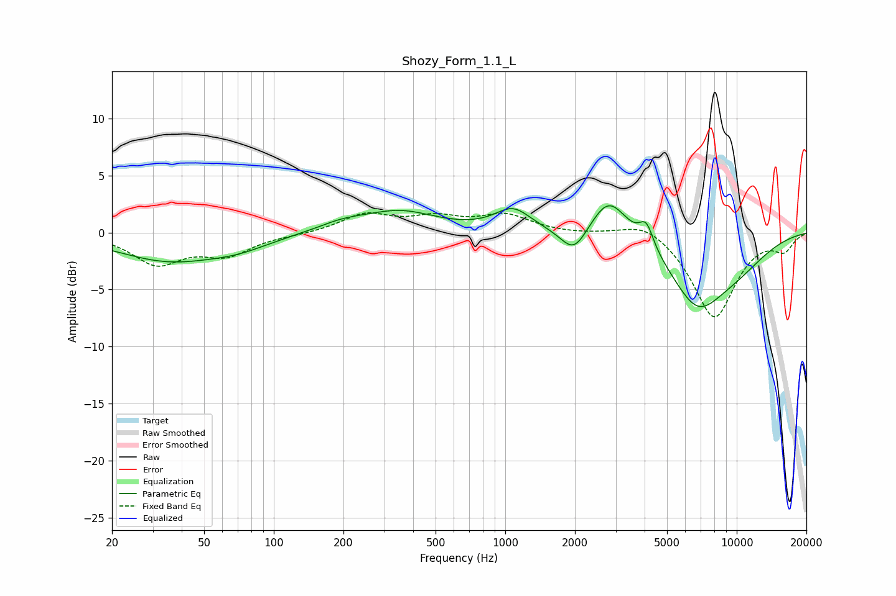

# Shozy_Form_1.1_L
See [usage instructions](https://github.com/jaakkopasanen/AutoEq#usage) for more options and info.

### Parametric EQs
Apply preamp of -2.5 dB when using parametric equalizer.

|   # | Type    |   Fc (Hz) |    Q |   Gain (dB) |
|-----|---------|-----------|------|-------------|
|   1 | Peaking |        35 | 0.62 |        -2.4 |
|   2 | Peaking |        71 | 1.04 |        -0.8 |
|   3 | Peaking |       198 | 1.3  |         0.7 |
|   4 | Peaking |       351 | 0.9  |         1.8 |
|   5 | Peaking |      1080 | 1.82 |         2   |
|   6 | Peaking |      1981 | 2.46 |        -2.3 |
|   7 | Peaking |      2807 | 1.8  |         3.6 |
|   8 | Peaking |      4069 | 4.58 |         2.1 |
|   9 | Peaking |      6696 | 1.18 |        -5.2 |
|  10 | Peaking |      9665 | 0.8  |        -2.4 |

### Fixed Band EQs
When using fixed band (also called graphic) equalizer, apply preamp of **-1.8 dB** (if available) and set gains manually with these parameters.

|   # | Type    |   Fc (Hz) |    Q |   Gain (dB) |
|-----|---------|-----------|------|-------------|
|   1 | Peaking |        31 | 1.41 |        -2.6 |
|   2 | Peaking |        62 | 1.41 |        -1.8 |
|   3 | Peaking |       125 | 1.41 |        -0.1 |
|   4 | Peaking |       250 | 1.41 |         1.6 |
|   5 | Peaking |       500 | 1.41 |         1.2 |
|   6 | Peaking |      1000 | 1.41 |         1.5 |
|   7 | Peaking |      2000 | 1.41 |        -0.1 |
|   8 | Peaking |      4000 | 1.41 |         1.2 |
|   9 | Peaking |      8000 | 1.41 |        -7.5 |
|  10 | Peaking |     16000 | 1.41 |        -1.4 |

### Graphs

