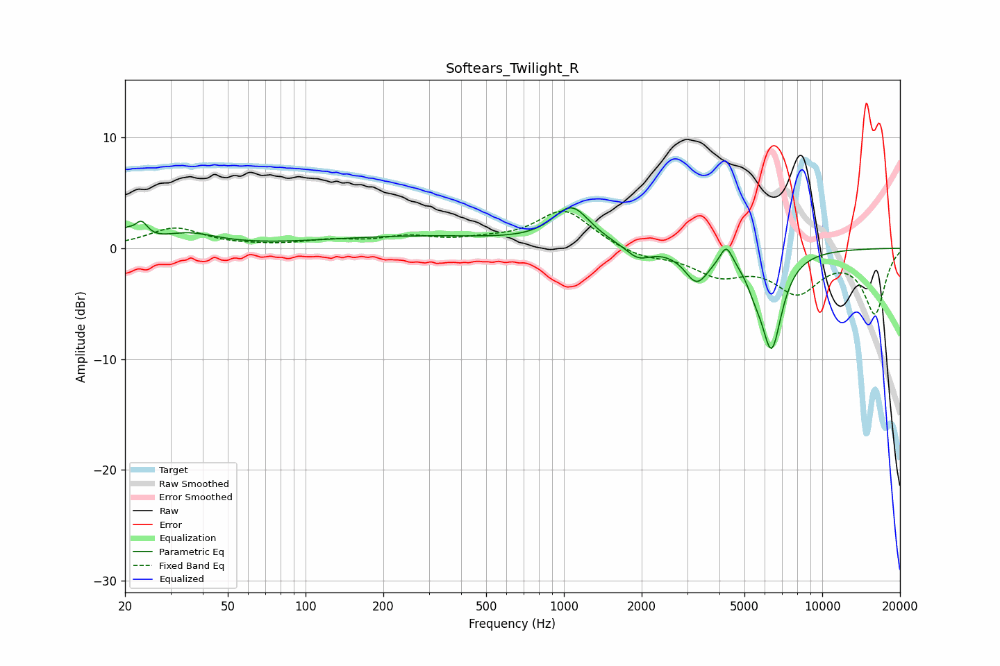

# Softears_Twilight_R
See [usage instructions](https://github.com/jaakkopasanen/AutoEq#usage) for more options and info.

### Parametric EQs
Apply preamp of -3.7 dB when using parametric equalizer.

|   # | Type    |   Fc (Hz) |    Q |   Gain (dB) |
|-----|---------|-----------|------|-------------|
|   1 | Peaking |        20 | 4.91 |         1.1 |
|   2 | Peaking |        23 | 5.88 |         1.5 |
|   3 | Peaking |        35 | 1.28 |         1.2 |
|   4 | Peaking |       274 | 0.36 |         1   |
|   5 | Peaking |      1071 | 1.97 |         3.4 |
|   6 | Peaking |      1935 | 2.99 |        -1.1 |
|   7 | Peaking |      3269 | 3.04 |        -2.8 |
|   8 | Peaking |      4255 | 5.98 |         1.7 |
|   9 | Peaking |      5472 | 4.49 |        -1.2 |
|  10 | Peaking |      6363 | 3.29 |        -8.6 |

### Fixed Band EQs
When using fixed band (also called graphic) equalizer, apply preamp of **-3.4 dB** (if available) and set gains manually with these parameters.

|   # | Type    |   Fc (Hz) |    Q |   Gain (dB) |
|-----|---------|-----------|------|-------------|
|   1 | Peaking |        31 | 1.41 |         1.8 |
|   2 | Peaking |        62 | 1.41 |         0.1 |
|   3 | Peaking |       125 | 1.41 |         0.6 |
|   4 | Peaking |       250 | 1.41 |         0.9 |
|   5 | Peaking |       500 | 1.41 |         0.5 |
|   6 | Peaking |      1000 | 1.41 |         3.4 |
|   7 | Peaking |      2000 | 1.41 |        -0.8 |
|   8 | Peaking |      4000 | 1.41 |        -2.1 |
|   9 | Peaking |      8000 | 1.41 |        -3.6 |
|  10 | Peaking |     16000 | 1.41 |        -5.8 |

### Graphs

