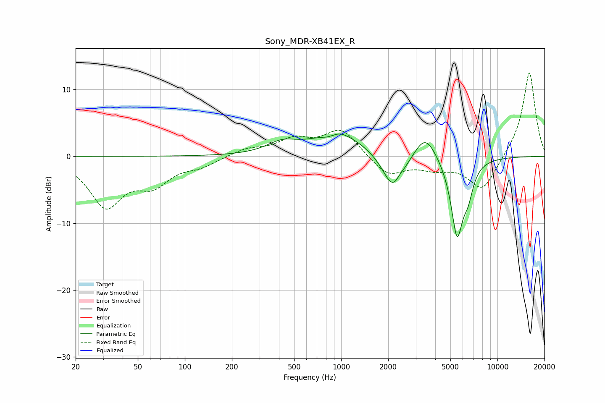

# Sony_MDR-XB41EX_R
See [usage instructions](https://github.com/jaakkopasanen/AutoEq#usage) for more options and info.

### Parametric EQs
Apply preamp of -3.4 dB when using parametric equalizer.

|   # | Type    |   Fc (Hz) |    Q |   Gain (dB) |
|-----|---------|-----------|------|-------------|
|   1 | Peaking |       416 | 1.51 |         1.5 |
|   2 | Peaking |       822 | 3.74 |        -0.4 |
|   3 | Peaking |       965 | 0.79 |         3.3 |
|   4 | Peaking |       996 | 3.04 |         0.4 |
|   5 | Peaking |      2139 | 1.83 |        -0.9 |
|   6 | Peaking |      2175 | 2.09 |        -5   |
|   7 | Peaking |      2363 | 5.16 |         0.7 |
|   8 | Peaking |      3456 | 1.98 |         3.9 |
|   9 | Peaking |      5518 | 3.39 |       -11.8 |
|  10 | Peaking |      6497 | 4.31 |        -3.2 |

### Fixed Band EQs
When using fixed band (also called graphic) equalizer, apply preamp of **-12.6 dB** (if available) and set gains manually with these parameters.

|   # | Type    |   Fc (Hz) |    Q |   Gain (dB) |
|-----|---------|-----------|------|-------------|
|   1 | Peaking |        31 | 1.41 |        -7.2 |
|   2 | Peaking |        62 | 1.41 |        -3.6 |
|   3 | Peaking |       125 | 1.41 |        -1.2 |
|   4 | Peaking |       250 | 1.41 |         1.1 |
|   5 | Peaking |       500 | 1.41 |         2.3 |
|   6 | Peaking |      1000 | 1.41 |         4   |
|   7 | Peaking |      2000 | 1.41 |        -2.9 |
|   8 | Peaking |      4000 | 1.41 |        -1.5 |
|   9 | Peaking |      8000 | 1.41 |        -5.2 |
|  10 | Peaking |     16000 | 1.41 |        12.9 |

### Graphs

