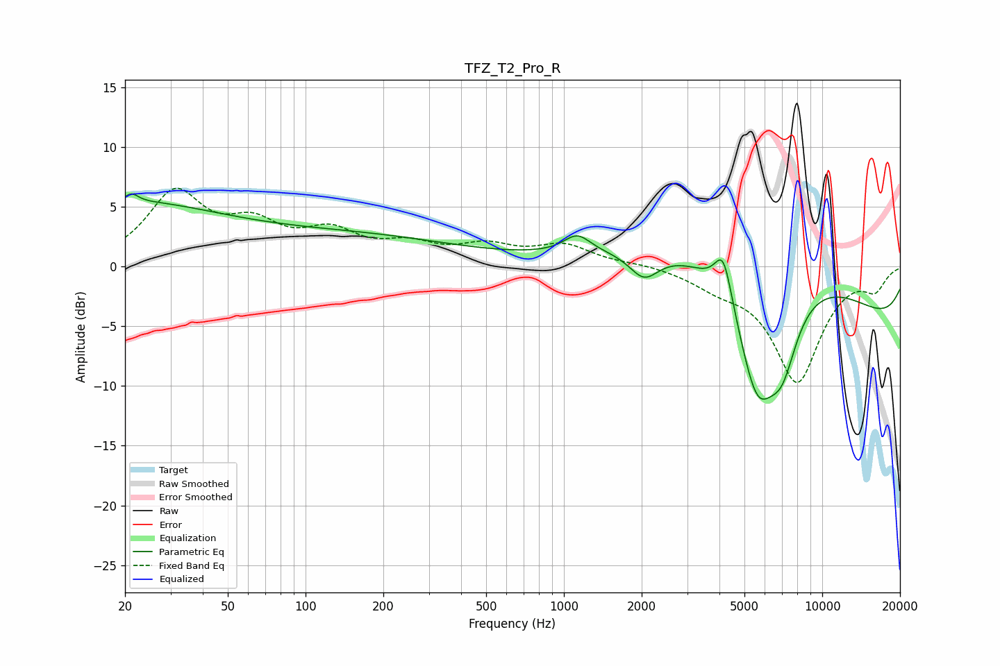

# TFZ_T2_Pro_R
See [usage instructions](https://github.com/jaakkopasanen/AutoEq#usage) for more options and info.

### Parametric EQs
Apply preamp of -6.2 dB when using parametric equalizer.

|   # | Type    |   Fc (Hz) |    Q |   Gain (dB) |
|-----|---------|-----------|------|-------------|
|   1 | Peaking |        20 | 0.38 |         5   |
|   2 | Peaking |        21 | 5.54 |         0.7 |
|   3 | Peaking |       154 | 0.34 |         2.3 |
|   4 | Peaking |      1126 | 2.71 |         1.5 |
|   5 | Peaking |      2043 | 2.46 |        -2.2 |
|   6 | Peaking |      4146 | 4.09 |         4   |
|   7 | Peaking |      5594 | 1.59 |       -10.9 |
|   8 | Peaking |      5799 | 0.29 |         8.3 |
|   9 | Peaking |      7003 | 2.27 |        -4.9 |
|  10 | Peaking |     10000 | 0.2  |        -7.2 |

### Fixed Band EQs
When using fixed band (also called graphic) equalizer, apply preamp of **-6.6 dB** (if available) and set gains manually with these parameters.

|   # | Type    |   Fc (Hz) |    Q |   Gain (dB) |
|-----|---------|-----------|------|-------------|
|   1 | Peaking |        31 | 1.41 |         5.9 |
|   2 | Peaking |        62 | 1.41 |         2.9 |
|   3 | Peaking |       125 | 1.41 |         2.5 |
|   4 | Peaking |       250 | 1.41 |         1.5 |
|   5 | Peaking |       500 | 1.41 |         1.5 |
|   6 | Peaking |      1000 | 1.41 |         1.7 |
|   7 | Peaking |      2000 | 1.41 |         0.3 |
|   8 | Peaking |      4000 | 1.41 |        -1.2 |
|   9 | Peaking |      8000 | 1.41 |        -9.5 |
|  10 | Peaking |     16000 | 1.41 |        -1.7 |

### Graphs

