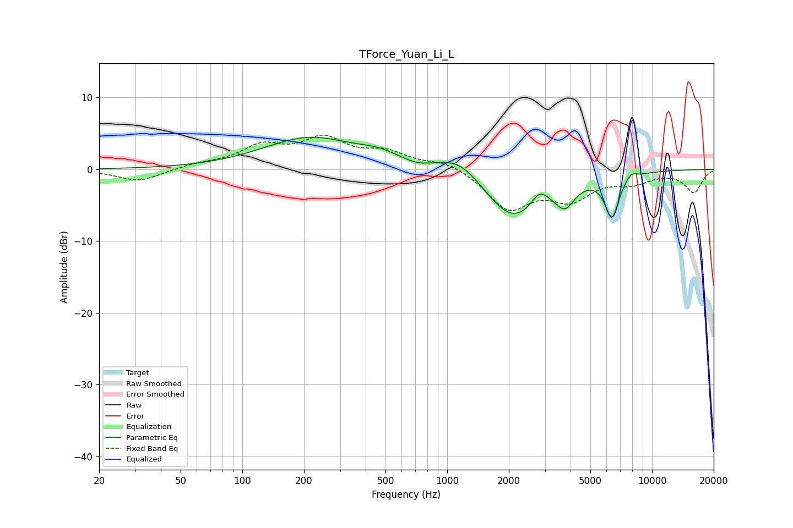

# TForce_Yuan_Li_L
See [usage instructions](https://github.com/jaakkopasanen/AutoEq#usage) for more options and info.

### Parametric EQs
Apply preamp of -4.6 dB when using parametric equalizer.

|   # | Type    |   Fc (Hz) |    Q |   Gain (dB) |
|-----|---------|-----------|------|-------------|
|   1 | Peaking |       214 | 0.62 |         4.3 |
|   2 | Peaking |       464 | 1.44 |         1.1 |
|   3 | Peaking |       714 | 2.45 |        -0.4 |
|   4 | Peaking |      1151 | 1.34 |         2.7 |
|   5 | Peaking |      2096 | 0.99 |        -7.1 |
|   6 | Peaking |      2825 | 3.62 |         2   |
|   7 | Peaking |      3758 | 2.92 |        -0.7 |
|   8 | Peaking |      3759 | 3.11 |        -2.4 |
|   9 | Peaking |      6369 | 4.02 |        -5.9 |
|  10 | Peaking |      7891 | 5.3  |         0.9 |

### Fixed Band EQs
When using fixed band (also called graphic) equalizer, apply preamp of **-4.9 dB** (if available) and set gains manually with these parameters.

|   # | Type    |   Fc (Hz) |    Q |   Gain (dB) |
|-----|---------|-----------|------|-------------|
|   1 | Peaking |        31 | 1.41 |        -1.7 |
|   2 | Peaking |        62 | 1.41 |         0.6 |
|   3 | Peaking |       125 | 1.41 |         2.9 |
|   4 | Peaking |       250 | 1.41 |         3.9 |
|   5 | Peaking |       500 | 1.41 |         2.1 |
|   6 | Peaking |      1000 | 1.41 |         1.2 |
|   7 | Peaking |      2000 | 1.41 |        -5.3 |
|   8 | Peaking |      4000 | 1.41 |        -3.7 |
|   9 | Peaking |      8000 | 1.41 |        -1.5 |
|  10 | Peaking |     16000 | 1.41 |        -3.2 |

### Graphs

