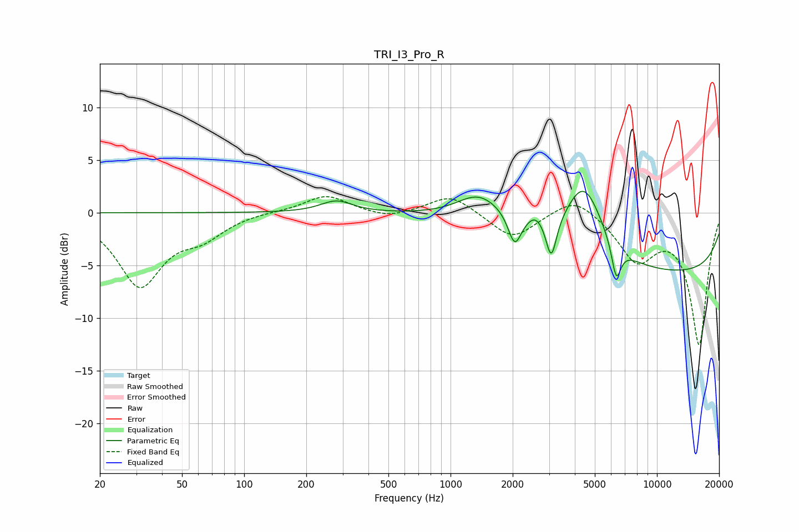

# TRI_I3_Pro_R
See [usage instructions](https://github.com/jaakkopasanen/AutoEq#usage) for more options and info.

### Parametric EQs
Apply preamp of -2.1 dB when using parametric equalizer.

|   # | Type    |   Fc (Hz) |    Q |   Gain (dB) |
|-----|---------|-----------|------|-------------|
|   1 | Peaking |       280 | 1.85 |         1.1 |
|   2 | Peaking |      1361 | 1.33 |         2.3 |
|   3 | Peaking |      1834 | 1.12 |         0.9 |
|   4 | Peaking |      2045 | 4.54 |        -2.9 |
|   5 | Peaking |      2580 | 3.49 |         1.1 |
|   6 | Peaking |      3077 | 5.74 |        -3.8 |
|   7 | Peaking |      4426 | 1.46 |         7   |
|   8 | Peaking |      6352 | 5.95 |        -3.4 |
|   9 | Peaking |     10000 | 0.18 |        -3.6 |
|  10 | Peaking |     10000 | 0.18 |        -2.2 |

### Fixed Band EQs
When using fixed band (also called graphic) equalizer, apply preamp of **-1.6 dB** (if available) and set gains manually with these parameters.

|   # | Type    |   Fc (Hz) |    Q |   Gain (dB) |
|-----|---------|-----------|------|-------------|
|   1 | Peaking |        31 | 1.41 |        -6.8 |
|   2 | Peaking |        62 | 1.41 |        -1.9 |
|   3 | Peaking |       125 | 1.41 |         0.1 |
|   4 | Peaking |       250 | 1.41 |         1.7 |
|   5 | Peaking |       500 | 1.41 |        -0.6 |
|   6 | Peaking |      1000 | 1.41 |         1.8 |
|   7 | Peaking |      2000 | 1.41 |        -2.5 |
|   8 | Peaking |      4000 | 1.41 |         1.8 |
|   9 | Peaking |      8000 | 1.41 |        -4.2 |
|  10 | Peaking |     16000 | 1.41 |       -12.4 |

### Graphs

