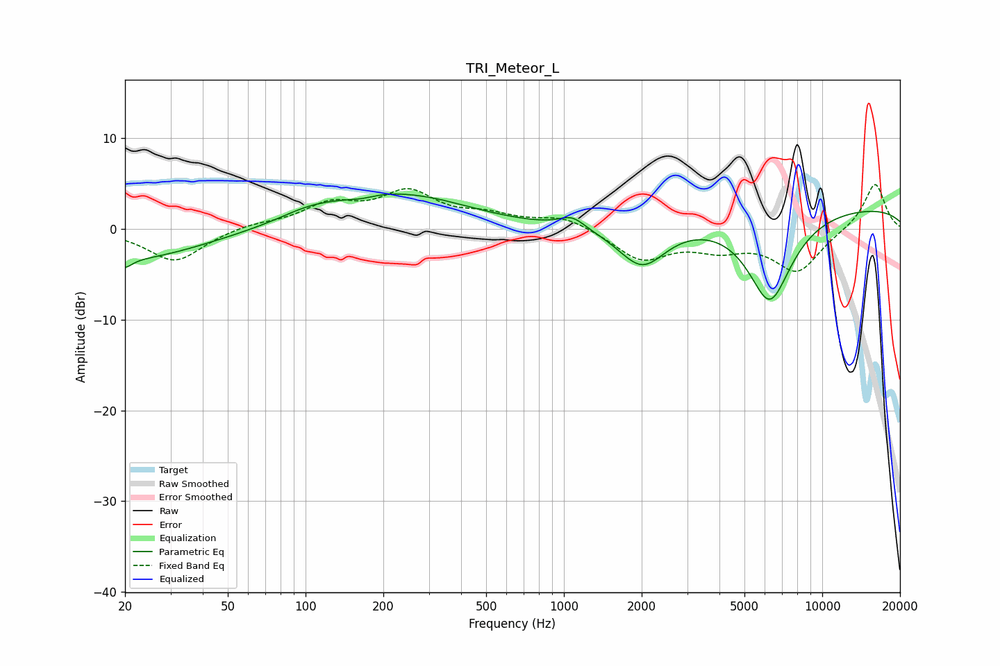

# TRI_Meteor_L
See [usage instructions](https://github.com/jaakkopasanen/AutoEq#usage) for more options and info.

### Parametric EQs
Apply preamp of -4.0 dB when using parametric equalizer.

|   # | Type    |   Fc (Hz) |    Q |   Gain (dB) |
|-----|---------|-----------|------|-------------|
|   1 | Peaking |        20 | 5.2  |        -1   |
|   2 | Peaking |        21 | 0.5  |        -3.3 |
|   3 | Peaking |       102 | 1.29 |         0.8 |
|   4 | Peaking |       166 | 2.21 |        -0.5 |
|   5 | Peaking |       219 | 0.57 |         4.4 |
|   6 | Peaking |       245 | 1.35 |        -0.4 |
|   7 | Peaking |      1077 | 2.84 |         1.3 |
|   8 | Peaking |      2009 | 1.51 |        -4.8 |
|   9 | Peaking |      6262 | 1.56 |        -9.9 |
|  10 | Peaking |     10000 | 0.18 |         2.5 |

### Fixed Band EQs
When using fixed band (also called graphic) equalizer, apply preamp of **-5.0 dB** (if available) and set gains manually with these parameters.

|   # | Type    |   Fc (Hz) |    Q |   Gain (dB) |
|-----|---------|-----------|------|-------------|
|   1 | Peaking |        31 | 1.41 |        -3.6 |
|   2 | Peaking |        62 | 1.41 |         0.5 |
|   3 | Peaking |       125 | 1.41 |         2.5 |
|   4 | Peaking |       250 | 1.41 |         3.8 |
|   5 | Peaking |       500 | 1.41 |         1.2 |
|   6 | Peaking |      1000 | 1.41 |         1.4 |
|   7 | Peaking |      2000 | 1.41 |        -3.3 |
|   8 | Peaking |      4000 | 1.41 |        -1.8 |
|   9 | Peaking |      8000 | 1.41 |        -4.6 |
|  10 | Peaking |     16000 | 1.41 |         5.2 |

### Graphs

