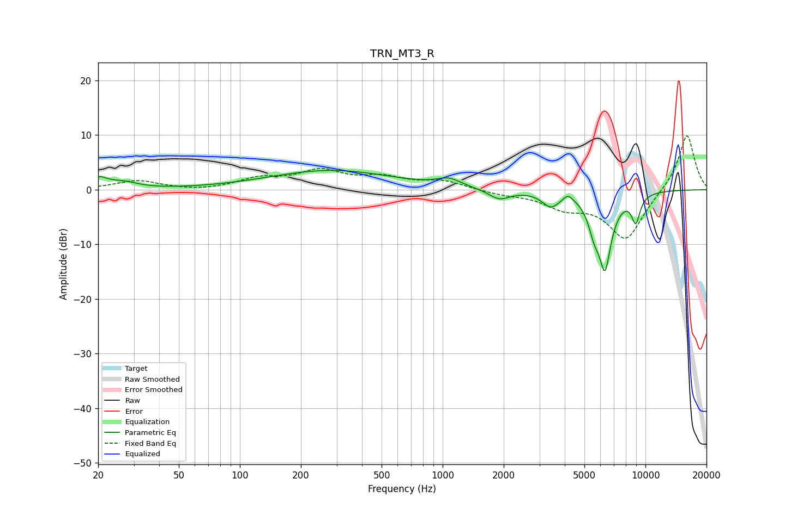

# TRN_MT3_R
See [usage instructions](https://github.com/jaakkopasanen/AutoEq#usage) for more options and info.

### Parametric EQs
Apply preamp of -3.6 dB when using parametric equalizer.

|   # | Type    |   Fc (Hz) |    Q |   Gain (dB) |
|-----|---------|-----------|------|-------------|
|   1 | Peaking |        20 | 3.17 |         1.9 |
|   2 | Peaking |        27 | 2.07 |         1.1 |
|   3 | Peaking |       282 | 0.47 |         3.5 |
|   4 | Peaking |      1075 | 2.46 |         1.4 |
|   5 | Peaking |      1902 | 2.64 |        -1.9 |
|   6 | Peaking |      3415 | 3.26 |        -2.6 |
|   7 | Peaking |      4154 | 6    |         1.2 |
|   8 | Peaking |      5578 | 4.98 |        -3.8 |
|   9 | Peaking |      6315 | 4.04 |       -13.3 |
|  10 | Peaking |      8962 | 6    |        -4.9 |

### Fixed Band EQs
When using fixed band (also called graphic) equalizer, apply preamp of **-10.0 dB** (if available) and set gains manually with these parameters.

|   # | Type    |   Fc (Hz) |    Q |   Gain (dB) |
|-----|---------|-----------|------|-------------|
|   1 | Peaking |        31 | 1.41 |         1.6 |
|   2 | Peaking |        62 | 1.41 |        -0.3 |
|   3 | Peaking |       125 | 1.41 |         1.8 |
|   4 | Peaking |       250 | 1.41 |         3.2 |
|   5 | Peaking |       500 | 1.41 |         1.9 |
|   6 | Peaking |      1000 | 1.41 |         1.5 |
|   7 | Peaking |      2000 | 1.41 |        -0.7 |
|   8 | Peaking |      4000 | 1.41 |        -2.8 |
|   9 | Peaking |      8000 | 1.41 |        -9.1 |
|  10 | Peaking |     16000 | 1.41 |        10.4 |

### Graphs

