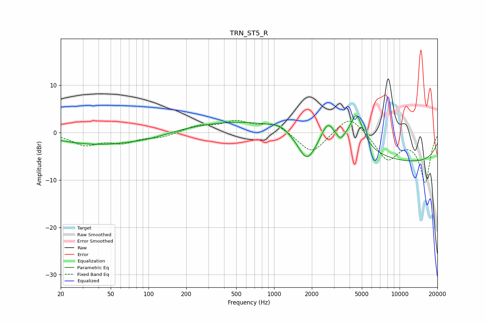

# TRN_ST5_R
See [usage instructions](https://github.com/jaakkopasanen/AutoEq#usage) for more options and info.

### Parametric EQs
Apply preamp of -3.6 dB when using parametric equalizer.

|   # | Type    |   Fc (Hz) |    Q |   Gain (dB) |
|-----|---------|-----------|------|-------------|
|   1 | Peaking |        37 | 0.49 |        -2.3 |
|   2 | Peaking |        53 | 2.26 |        -0.1 |
|   3 | Peaking |        98 | 0.8  |        -0.9 |
|   4 | Peaking |      1072 | 0.18 |         2.9 |
|   5 | Peaking |      1119 | 2.26 |         0.8 |
|   6 | Peaking |      1824 | 1.93 |        -6.2 |
|   7 | Peaking |      2674 | 2.84 |         4.2 |
|   8 | Peaking |      3378 | 5.64 |        -1.1 |
|   9 | Peaking |      4544 | 2.65 |         7.3 |
|  10 | Peaking |     10000 | 0.18 |        -6.5 |

### Fixed Band EQs
When using fixed band (also called graphic) equalizer, apply preamp of **-2.7 dB** (if available) and set gains manually with these parameters.

|   # | Type    |   Fc (Hz) |    Q |   Gain (dB) |
|-----|---------|-----------|------|-------------|
|   1 | Peaking |        31 | 1.41 |        -2.5 |
|   2 | Peaking |        62 | 1.41 |        -1.9 |
|   3 | Peaking |       125 | 1.41 |        -0.9 |
|   4 | Peaking |       250 | 1.41 |         1.4 |
|   5 | Peaking |       500 | 1.41 |         2.1 |
|   6 | Peaking |      1000 | 1.41 |         2   |
|   7 | Peaking |      2000 | 1.41 |        -4.6 |
|   8 | Peaking |      4000 | 1.41 |         4.1 |
|   9 | Peaking |      8000 | 1.41 |        -5.6 |
|  10 | Peaking |     16000 | 1.41 |       -10.4 |

### Graphs

