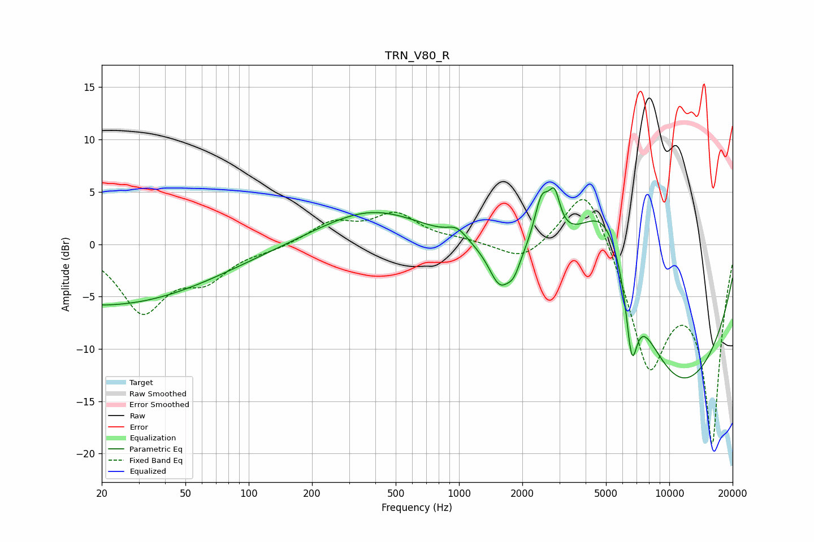

# TRN_V80_R
See [usage instructions](https://github.com/jaakkopasanen/AutoEq#usage) for more options and info.

### Parametric EQs
Apply preamp of -5.5 dB when using parametric equalizer.

|   # | Type    |   Fc (Hz) |    Q |   Gain (dB) |
|-----|---------|-----------|------|-------------|
|   1 | Peaking |        20 | 0.26 |        -5.8 |
|   2 | Peaking |       388 | 0.56 |         3.4 |
|   3 | Peaking |       979 | 3.09 |         1.1 |
|   4 | Peaking |      1560 | 2.73 |        -3.6 |
|   5 | Peaking |      1823 | 4.37 |        -1.6 |
|   6 | Peaking |      2471 | 3.98 |         4.4 |
|   7 | Peaking |      2847 | 5.26 |         3.6 |
|   8 | Peaking |      5008 | 0.75 |        13.5 |
|   9 | Peaking |      6625 | 4.93 |        -7   |
|  10 | Peaking |     10000 | 0.31 |       -16.5 |

### Fixed Band EQs
When using fixed band (also called graphic) equalizer, apply preamp of **-4.4 dB** (if available) and set gains manually with these parameters.

|   # | Type    |   Fc (Hz) |    Q |   Gain (dB) |
|-----|---------|-----------|------|-------------|
|   1 | Peaking |        31 | 1.41 |        -6.2 |
|   2 | Peaking |        62 | 1.41 |        -2.9 |
|   3 | Peaking |       125 | 1.41 |        -0.4 |
|   4 | Peaking |       250 | 1.41 |         2   |
|   5 | Peaking |       500 | 1.41 |         2.7 |
|   6 | Peaking |      1000 | 1.41 |         0.3 |
|   7 | Peaking |      2000 | 1.41 |        -1.8 |
|   8 | Peaking |      4000 | 1.41 |         6.7 |
|   9 | Peaking |      8000 | 1.41 |       -11.3 |
|  10 | Peaking |     16000 | 1.41 |       -18.6 |

### Graphs

