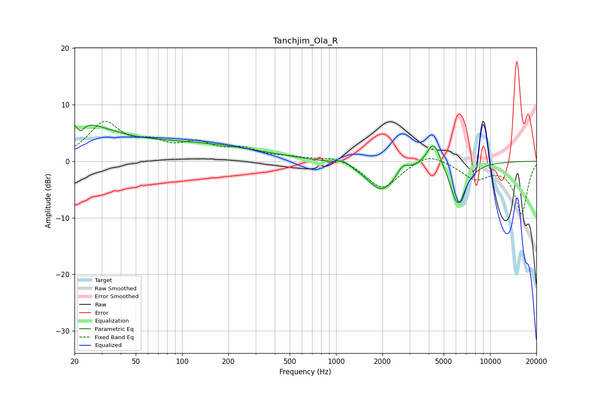

# Tanchjim_Ola_R
See [usage instructions](https://github.com/jaakkopasanen/AutoEq#usage) for more options and info.

### Parametric EQs
Apply preamp of -6.5 dB when using parametric equalizer.

|   # | Type    |   Fc (Hz) |    Q |   Gain (dB) |
|-----|---------|-----------|------|-------------|
|   1 | Peaking |        20 | 0.65 |         6.3 |
|   2 | Peaking |        21 | 5.98 |         3.2 |
|   3 | Peaking |        22 | 5.9  |        -4.8 |
|   4 | Peaking |       112 | 0.31 |         3   |
|   5 | Peaking |      1112 | 3.47 |         0.9 |
|   6 | Peaking |      1983 | 1.47 |        -5.2 |
|   7 | Peaking |      2708 | 4.09 |         1.6 |
|   8 | Peaking |      4307 | 3.14 |         4.8 |
|   9 | Peaking |      5418 | 3.19 |         0.4 |
|  10 | Peaking |      6161 | 2.59 |        -7.9 |

### Fixed Band EQs
When using fixed band (also called graphic) equalizer, apply preamp of **-7.1 dB** (if available) and set gains manually with these parameters.

|   # | Type    |   Fc (Hz) |    Q |   Gain (dB) |
|-----|---------|-----------|------|-------------|
|   1 | Peaking |        31 | 1.41 |         6.5 |
|   2 | Peaking |        62 | 1.41 |         2.5 |
|   3 | Peaking |       125 | 1.41 |         2.7 |
|   4 | Peaking |       250 | 1.41 |         1.9 |
|   5 | Peaking |       500 | 1.41 |         0.5 |
|   6 | Peaking |      1000 | 1.41 |         0.9 |
|   7 | Peaking |      2000 | 1.41 |        -5   |
|   8 | Peaking |      4000 | 1.41 |         1.8 |
|   9 | Peaking |      8000 | 1.41 |        -2.9 |
|  10 | Peaking |     16000 | 1.41 |        -9.2 |

### Graphs

