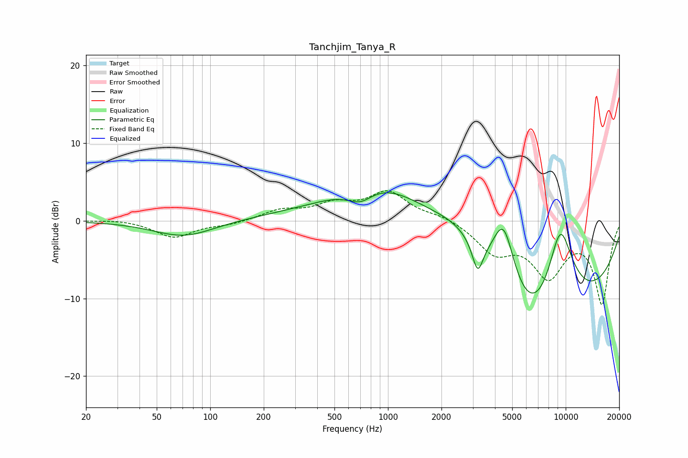

# Tanchjim_Tanya_R
See [usage instructions](https://github.com/jaakkopasanen/AutoEq#usage) for more options and info.

### Parametric EQs
Apply preamp of -3.7 dB when using parametric equalizer.

|   # | Type    |   Fc (Hz) |    Q |   Gain (dB) |
|-----|---------|-----------|------|-------------|
|   1 | Peaking |        71 | 0.83 |        -2.1 |
|   2 | Peaking |       506 | 0.41 |        -2.9 |
|   3 | Peaking |       699 | 1.89 |        -2   |
|   4 | Peaking |       900 | 0.38 |        11.9 |
|   5 | Peaking |      1892 | 0.24 |        -2.8 |
|   6 | Peaking |      2592 | 0.68 |         6.6 |
|   7 | Peaking |      3198 | 4.65 |        -4   |
|   8 | Peaking |      4476 | 1.97 |         9.9 |
|   9 | Peaking |      6650 | 0.29 |       -20   |
|  10 | Peaking |      9301 | 1.31 |        14.9 |

### Fixed Band EQs
When using fixed band (also called graphic) equalizer, apply preamp of **-3.9 dB** (if available) and set gains manually with these parameters.

|   # | Type    |   Fc (Hz) |    Q |   Gain (dB) |
|-----|---------|-----------|------|-------------|
|   1 | Peaking |        31 | 1.41 |         0.2 |
|   2 | Peaking |        62 | 1.41 |        -2.1 |
|   3 | Peaking |       125 | 1.41 |        -0.5 |
|   4 | Peaking |       250 | 1.41 |         1.2 |
|   5 | Peaking |       500 | 1.41 |         1.9 |
|   6 | Peaking |      1000 | 1.41 |         3.5 |
|   7 | Peaking |      2000 | 1.41 |         0.7 |
|   8 | Peaking |      4000 | 1.41 |        -3.7 |
|   9 | Peaking |      8000 | 1.41 |        -6.6 |
|  10 | Peaking |     16000 | 1.41 |       -10.5 |

### Graphs

