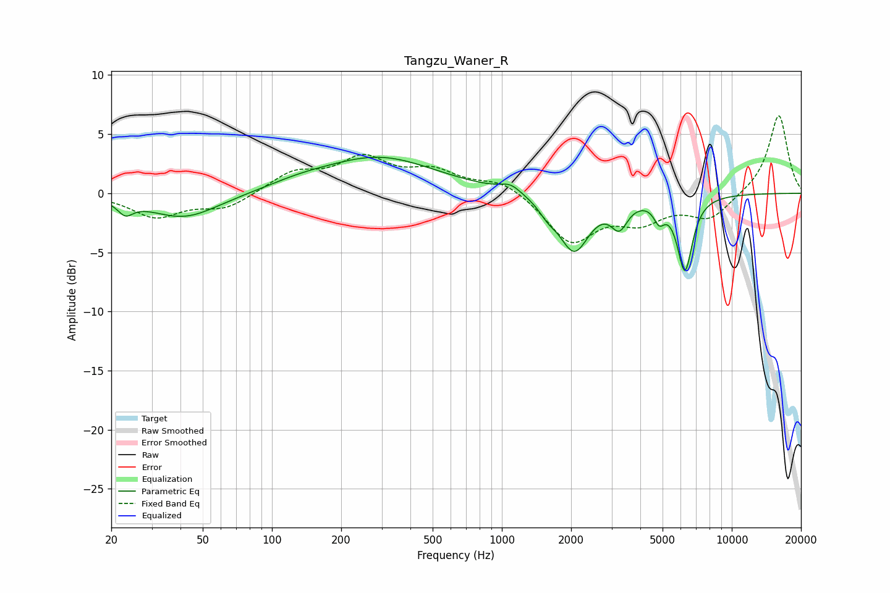

# Tangzu_Waner_R
See [usage instructions](https://github.com/jaakkopasanen/AutoEq#usage) for more options and info.

### Parametric EQs
Apply preamp of -3.1 dB when using parametric equalizer.

|   # | Type    |   Fc (Hz) |    Q |   Gain (dB) |
|-----|---------|-----------|------|-------------|
|   1 | Peaking |        23 | 4.34 |        -1.1 |
|   2 | Peaking |        41 | 0.92 |        -2.1 |
|   3 | Peaking |       132 | 1.04 |         0.5 |
|   4 | Peaking |       292 | 0.58 |         3   |
|   5 | Peaking |      1091 | 3.14 |         0.7 |
|   6 | Peaking |      1583 | 3.67 |        -0.8 |
|   7 | Peaking |      2063 | 2.15 |        -4.8 |
|   8 | Peaking |      3243 | 3.93 |        -2.1 |
|   9 | Peaking |      4831 | 6    |        -1.4 |
|  10 | Peaking |      6251 | 4.17 |        -6.3 |

### Fixed Band EQs
When using fixed band (also called graphic) equalizer, apply preamp of **-6.7 dB** (if available) and set gains manually with these parameters.

|   # | Type    |   Fc (Hz) |    Q |   Gain (dB) |
|-----|---------|-----------|------|-------------|
|   1 | Peaking |        31 | 1.41 |        -1.9 |
|   2 | Peaking |        62 | 1.41 |        -1.3 |
|   3 | Peaking |       125 | 1.41 |         1.7 |
|   4 | Peaking |       250 | 1.41 |         2.7 |
|   5 | Peaking |       500 | 1.41 |         1.7 |
|   6 | Peaking |      1000 | 1.41 |         1.1 |
|   7 | Peaking |      2000 | 1.41 |        -4.1 |
|   8 | Peaking |      4000 | 1.41 |        -2   |
|   9 | Peaking |      8000 | 1.41 |        -2.1 |
|  10 | Peaking |     16000 | 1.41 |         6.7 |

### Graphs

