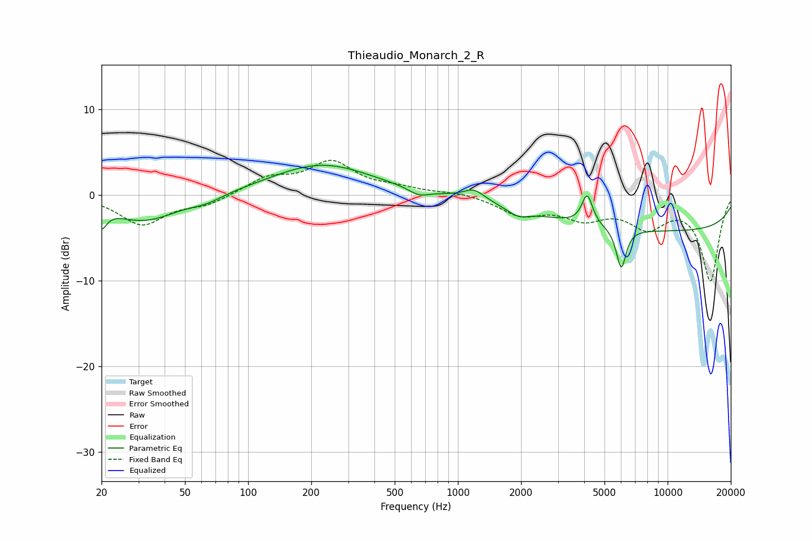

# Thieaudio_Monarch_2_R
See [usage instructions](https://github.com/jaakkopasanen/AutoEq#usage) for more options and info.

### Parametric EQs
Apply preamp of -3.5 dB when using parametric equalizer.

|   # | Type    |   Fc (Hz) |    Q |   Gain (dB) |
|-----|---------|-----------|------|-------------|
|   1 | Peaking |        20 | 5.7  |        -2.2 |
|   2 | Peaking |        32 | 0.86 |        -3   |
|   3 | Peaking |        64 | 1.91 |        -0.7 |
|   4 | Peaking |       225 | 0.59 |         3.6 |
|   5 | Peaking |       652 | 2.96 |        -0.8 |
|   6 | Peaking |      1195 | 2.72 |         1.3 |
|   7 | Peaking |      1938 | 2.87 |        -0.9 |
|   8 | Peaking |      4134 | 5.53 |         3.5 |
|   9 | Peaking |      6008 | 6    |        -4.7 |
|  10 | Peaking |     10000 | 0.18 |        -4.2 |

### Fixed Band EQs
When using fixed band (also called graphic) equalizer, apply preamp of **-4.1 dB** (if available) and set gains manually with these parameters.

|   # | Type    |   Fc (Hz) |    Q |   Gain (dB) |
|-----|---------|-----------|------|-------------|
|   1 | Peaking |        31 | 1.41 |        -3.4 |
|   2 | Peaking |        62 | 1.41 |        -1.1 |
|   3 | Peaking |       125 | 1.41 |         1.8 |
|   4 | Peaking |       250 | 1.41 |         3.6 |
|   5 | Peaking |       500 | 1.41 |         0.7 |
|   6 | Peaking |      1000 | 1.41 |         0.3 |
|   7 | Peaking |      2000 | 1.41 |        -2.2 |
|   8 | Peaking |      4000 | 1.41 |        -2.3 |
|   9 | Peaking |      8000 | 1.41 |        -3.3 |
|  10 | Peaking |     16000 | 1.41 |        -9.9 |

### Graphs

