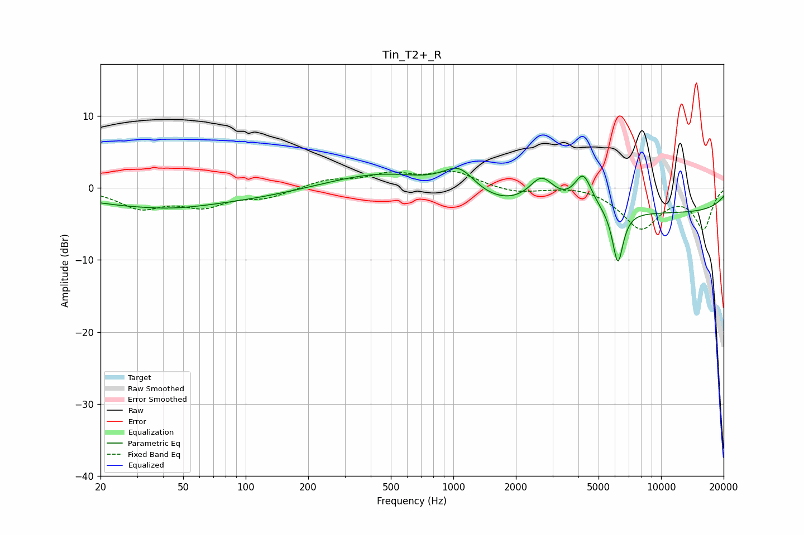

# Tin_T2+_R
See [usage instructions](https://github.com/jaakkopasanen/AutoEq#usage) for more options and info.

### Parametric EQs
Apply preamp of -2.8 dB when using parametric equalizer.

|   # | Type    |   Fc (Hz) |    Q |   Gain (dB) |
|-----|---------|-----------|------|-------------|
|   1 | Peaking |        25 | 1.88 |        -0.1 |
|   2 | Peaking |        42 | 0.75 |        -0.8 |
|   3 | Peaking |        44 | 0.26 |        -2.1 |
|   4 | Peaking |       477 | 0.53 |         2.5 |
|   5 | Peaking |      1069 | 1.69 |         3.9 |
|   6 | Peaking |      1372 | 0.65 |        -2.3 |
|   7 | Peaking |      2660 | 2.34 |         3.8 |
|   8 | Peaking |      4219 | 3.31 |         4.6 |
|   9 | Peaking |      6192 | 5.27 |        -7.5 |
|  10 | Peaking |     10000 | 0.18 |        -3.4 |

### Fixed Band EQs
When using fixed band (also called graphic) equalizer, apply preamp of **-2.4 dB** (if available) and set gains manually with these parameters.

|   # | Type    |   Fc (Hz) |    Q |   Gain (dB) |
|-----|---------|-----------|------|-------------|
|   1 | Peaking |        31 | 1.41 |        -2.6 |
|   2 | Peaking |        62 | 1.41 |        -2.3 |
|   3 | Peaking |       125 | 1.41 |        -1.2 |
|   4 | Peaking |       250 | 1.41 |         1.1 |
|   5 | Peaking |       500 | 1.41 |         1.7 |
|   6 | Peaking |      1000 | 1.41 |         2.1 |
|   7 | Peaking |      2000 | 1.41 |        -0.8 |
|   8 | Peaking |      4000 | 1.41 |         0.5 |
|   9 | Peaking |      8000 | 1.41 |        -5.5 |
|  10 | Peaking |     16000 | 1.41 |        -5.5 |

### Graphs

