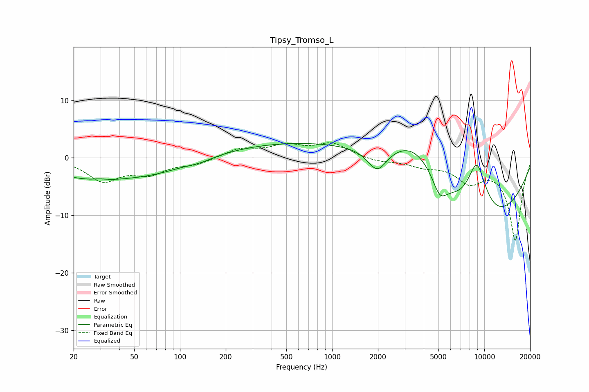

# Tipsy_Tromso_L
See [usage instructions](https://github.com/jaakkopasanen/AutoEq#usage) for more options and info.

### Parametric EQs
Apply preamp of -2.6 dB when using parametric equalizer.

|   # | Type    |   Fc (Hz) |    Q |   Gain (dB) |
|-----|---------|-----------|------|-------------|
|   1 | Peaking |        26 | 0.51 |        -3.4 |
|   2 | Peaking |        30 | 3.17 |         0.2 |
|   3 | Peaking |        71 | 0.64 |        -1.7 |
|   4 | Peaking |       136 | 1.75 |        -0.5 |
|   5 | Peaking |       784 | 0.24 |         2.9 |
|   6 | Peaking |      1982 | 2.21 |        -4.1 |
|   7 | Peaking |      3532 | 0.72 |         8   |
|   8 | Peaking |      5093 | 3.01 |        -3.3 |
|   9 | Peaking |      8619 | 0.32 |       -13.7 |
|  10 | Peaking |      8930 | 1.82 |        10.4 |

### Fixed Band EQs
When using fixed band (also called graphic) equalizer, apply preamp of **-2.7 dB** (if available) and set gains manually with these parameters.

|   # | Type    |   Fc (Hz) |    Q |   Gain (dB) |
|-----|---------|-----------|------|-------------|
|   1 | Peaking |        31 | 1.41 |        -3.8 |
|   2 | Peaking |        62 | 1.41 |        -2.5 |
|   3 | Peaking |       125 | 1.41 |        -1   |
|   4 | Peaking |       250 | 1.41 |         1.5 |
|   5 | Peaking |       500 | 1.41 |         1.9 |
|   6 | Peaking |      1000 | 1.41 |         2.4 |
|   7 | Peaking |      2000 | 1.41 |        -0.6 |
|   8 | Peaking |      4000 | 1.41 |        -1.2 |
|   9 | Peaking |      8000 | 1.41 |        -3.7 |
|  10 | Peaking |     16000 | 1.41 |       -14.2 |

### Graphs

