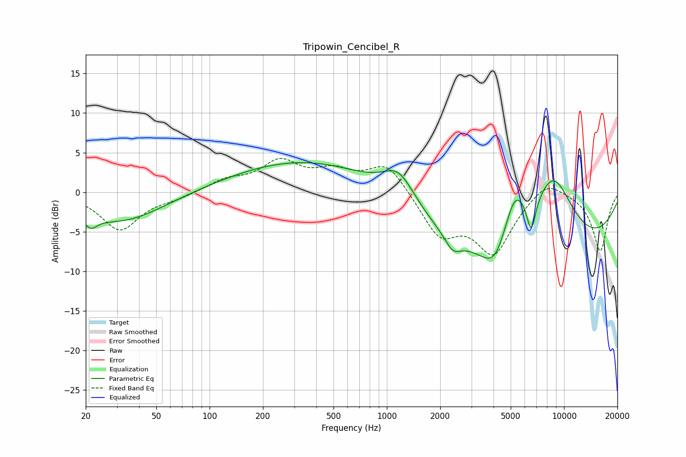

# Tripowin_Cencibel_R
See [usage instructions](https://github.com/jaakkopasanen/AutoEq#usage) for more options and info.

### Parametric EQs
Apply preamp of -3.8 dB when using parametric equalizer.

|   # | Type    |   Fc (Hz) |    Q |   Gain (dB) |
|-----|---------|-----------|------|-------------|
|   1 | Peaking |        21 | 3.69 |        -1.6 |
|   2 | Peaking |        32 | 0.59 |        -3.8 |
|   3 | Peaking |       469 | 0.27 |         4.7 |
|   4 | Peaking |      1171 | 1.55 |         3.9 |
|   5 | Peaking |      2356 | 3.18 |        -1.8 |
|   6 | Peaking |      4097 | 1.83 |        -4.1 |
|   7 | Peaking |      5262 | 1.99 |         6.5 |
|   8 | Peaking |      6071 | 0.18 |       -10.3 |
|   9 | Peaking |      6524 | 5.45 |        -4.3 |
|  10 | Peaking |      8659 | 0.96 |        10.8 |

### Fixed Band EQs
When using fixed band (also called graphic) equalizer, apply preamp of **-4.4 dB** (if available) and set gains manually with these parameters.

|   # | Type    |   Fc (Hz) |    Q |   Gain (dB) |
|-----|---------|-----------|------|-------------|
|   1 | Peaking |        31 | 1.41 |        -4.7 |
|   2 | Peaking |        62 | 1.41 |        -0.6 |
|   3 | Peaking |       125 | 1.41 |         1.4 |
|   4 | Peaking |       250 | 1.41 |         3.6 |
|   5 | Peaking |       500 | 1.41 |         2.2 |
|   6 | Peaking |      1000 | 1.41 |         3.7 |
|   7 | Peaking |      2000 | 1.41 |        -5.2 |
|   8 | Peaking |      4000 | 1.41 |        -7.4 |
|   9 | Peaking |      8000 | 1.41 |         2.1 |
|  10 | Peaking |     16000 | 1.41 |        -7.4 |

### Graphs

