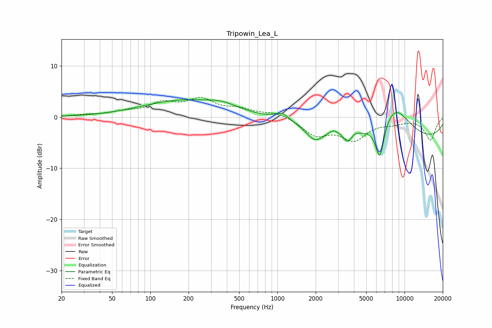

# Tripowin_Lea_L
See [usage instructions](https://github.com/jaakkopasanen/AutoEq#usage) for more options and info.

### Parametric EQs
Apply preamp of -3.5 dB when using parametric equalizer.

|   # | Type    |   Fc (Hz) |    Q |   Gain (dB) |
|-----|---------|-----------|------|-------------|
|   1 | Peaking |       182 | 0.43 |         3.2 |
|   2 | Peaking |       369 | 1.28 |         1   |
|   3 | Peaking |      1099 | 2.58 |         1.5 |
|   4 | Peaking |      1975 | 2.21 |        -2.6 |
|   5 | Peaking |      2770 | 3.9  |         0.9 |
|   6 | Peaking |      3567 | 4.45 |        -1.8 |
|   7 | Peaking |      4089 | 5.91 |         0.4 |
|   8 | Peaking |      6396 | 3.88 |        -7.4 |
|   9 | Peaking |      8275 | 1    |         6.6 |
|  10 | Peaking |      9398 | 0.18 |        -4.8 |

### Fixed Band EQs
When using fixed band (also called graphic) equalizer, apply preamp of **-4.0 dB** (if available) and set gains manually with these parameters.

|   # | Type    |   Fc (Hz) |    Q |   Gain (dB) |
|-----|---------|-----------|------|-------------|
|   1 | Peaking |        31 | 1.41 |         0.4 |
|   2 | Peaking |        62 | 1.41 |         0.8 |
|   3 | Peaking |       125 | 1.41 |         2.5 |
|   4 | Peaking |       250 | 1.41 |         3.2 |
|   5 | Peaking |       500 | 1.41 |         1.3 |
|   6 | Peaking |      1000 | 1.41 |         1   |
|   7 | Peaking |      2000 | 1.41 |        -3.3 |
|   8 | Peaking |      4000 | 1.41 |        -4.1 |
|   9 | Peaking |      8000 | 1.41 |        -0.9 |
|  10 | Peaking |     16000 | 1.41 |        -4.4 |

### Graphs

