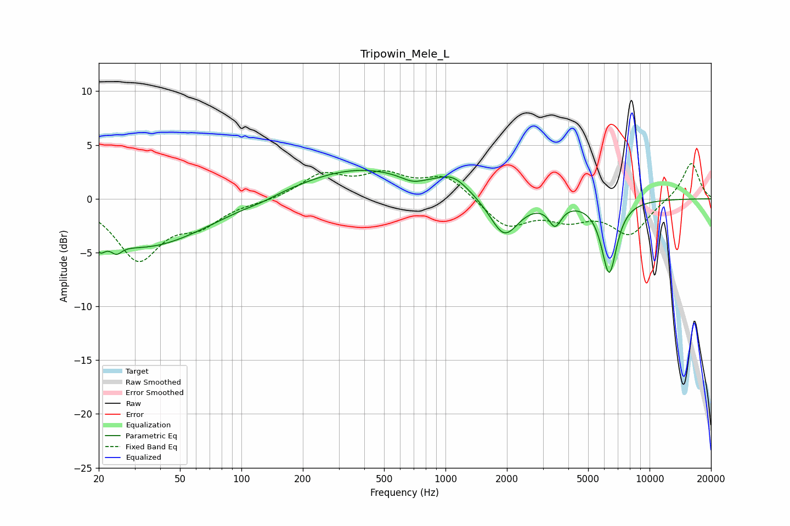

# Tripowin_Mele_L
See [usage instructions](https://github.com/jaakkopasanen/AutoEq#usage) for more options and info.

### Parametric EQs
Apply preamp of -2.7 dB when using parametric equalizer.

|   # | Type    |   Fc (Hz) |    Q |   Gain (dB) |
|-----|---------|-----------|------|-------------|
|   1 | Peaking |        20 | 5.73 |        -1.2 |
|   2 | Peaking |        24 | 5.5  |        -0.9 |
|   3 | Peaking |        33 | 0.46 |        -4.5 |
|   4 | Peaking |       126 | 2.23 |        -0.2 |
|   5 | Peaking |       374 | 0.47 |         2.8 |
|   6 | Peaking |       688 | 2.58 |        -0.6 |
|   7 | Peaking |      1088 | 1.83 |         1.4 |
|   8 | Peaking |      1941 | 2.02 |        -3.7 |
|   9 | Peaking |      3444 | 4.6  |        -2   |
|  10 | Peaking |      6342 | 3.63 |        -6.8 |

### Fixed Band EQs
When using fixed band (also called graphic) equalizer, apply preamp of **-3.4 dB** (if available) and set gains manually with these parameters.

|   # | Type    |   Fc (Hz) |    Q |   Gain (dB) |
|-----|---------|-----------|------|-------------|
|   1 | Peaking |        31 | 1.41 |        -5.5 |
|   2 | Peaking |        62 | 1.41 |        -2   |
|   3 | Peaking |       125 | 1.41 |        -0.2 |
|   4 | Peaking |       250 | 1.41 |         2.2 |
|   5 | Peaking |       500 | 1.41 |         2   |
|   6 | Peaking |      1000 | 1.41 |         2.1 |
|   7 | Peaking |      2000 | 1.41 |        -2.6 |
|   8 | Peaking |      4000 | 1.41 |        -1.6 |
|   9 | Peaking |      8000 | 1.41 |        -3.2 |
|  10 | Peaking |     16000 | 1.41 |         3.5 |

### Graphs

