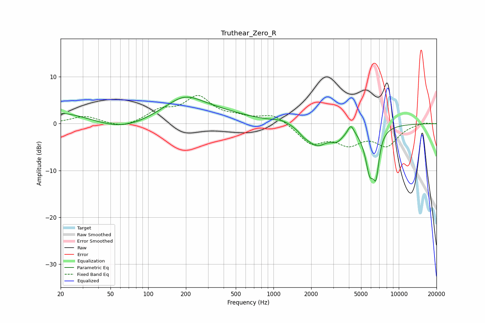

# Truthear_Zero_R
See [usage instructions](https://github.com/jaakkopasanen/AutoEq#usage) for more options and info.

### Parametric EQs
Apply preamp of -5.8 dB when using parametric equalizer.

|   # | Type    |   Fc (Hz) |    Q |   Gain (dB) |
|-----|---------|-----------|------|-------------|
|   1 | Peaking |        62 | 0.44 |        -7.6 |
|   2 | Peaking |        69 | 0.18 |         7.1 |
|   3 | Peaking |       194 | 1.06 |         2.8 |
|   4 | Peaking |      1168 | 2.08 |         0.7 |
|   5 | Peaking |      1759 | 3.01 |        -1   |
|   6 | Peaking |      2233 | 1.82 |        -4   |
|   7 | Peaking |      3199 | 2.53 |        -2.3 |
|   8 | Peaking |      4146 | 6    |         2   |
|   9 | Peaking |      5872 | 3.66 |        -9   |
|  10 | Peaking |      6592 | 5.9  |        -7.2 |

### Fixed Band EQs
When using fixed band (also called graphic) equalizer, apply preamp of **-6.1 dB** (if available) and set gains manually with these parameters.

|   # | Type    |   Fc (Hz) |    Q |   Gain (dB) |
|-----|---------|-----------|------|-------------|
|   1 | Peaking |        31 | 1.41 |         1.6 |
|   2 | Peaking |        62 | 1.41 |        -1.1 |
|   3 | Peaking |       125 | 1.41 |         2.5 |
|   4 | Peaking |       250 | 1.41 |         5.4 |
|   5 | Peaking |       500 | 1.41 |         1   |
|   6 | Peaking |      1000 | 1.41 |         2.1 |
|   7 | Peaking |      2000 | 1.41 |        -4   |
|   8 | Peaking |      4000 | 1.41 |        -3.7 |
|   9 | Peaking |      8000 | 1.41 |        -4.3 |
|  10 | Peaking |     16000 | 1.41 |         0.3 |

### Graphs

