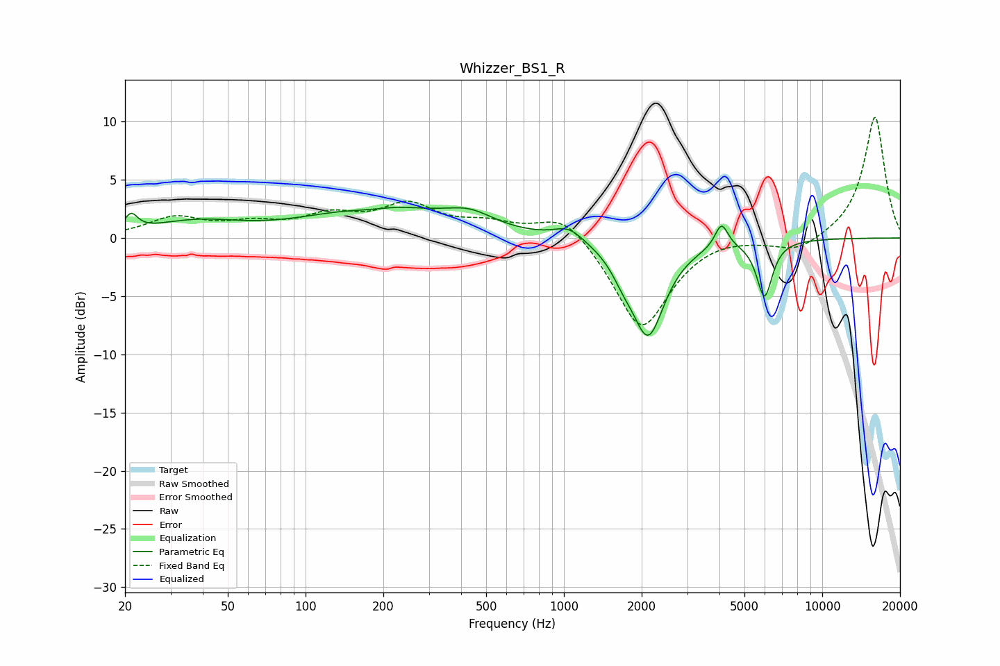

# Whizzer_BS1_R
See [usage instructions](https://github.com/jaakkopasanen/AutoEq#usage) for more options and info.

### Parametric EQs
Apply preamp of -2.7 dB when using parametric equalizer.

|   # | Type    |   Fc (Hz) |    Q |   Gain (dB) |
|-----|---------|-----------|------|-------------|
|   1 | Peaking |        21 | 5.79 |         1.4 |
|   2 | Peaking |        37 | 0.82 |         1.3 |
|   3 | Peaking |       173 | 1.55 |        -0.4 |
|   4 | Peaking |       193 | 0.56 |         2.7 |
|   5 | Peaking |       432 | 1.54 |         1.2 |
|   6 | Peaking |      1046 | 2.47 |         1.1 |
|   7 | Peaking |      1689 | 3.44 |        -1.1 |
|   8 | Peaking |      2118 | 2.17 |        -8.2 |
|   9 | Peaking |      4075 | 5.57 |         2.1 |
|  10 | Peaking |      5978 | 4.61 |        -4.8 |

### Fixed Band EQs
When using fixed band (also called graphic) equalizer, apply preamp of **-10.5 dB** (if available) and set gains manually with these parameters.

|   # | Type    |   Fc (Hz) |    Q |   Gain (dB) |
|-----|---------|-----------|------|-------------|
|   1 | Peaking |        31 | 1.41 |         1.6 |
|   2 | Peaking |        62 | 1.41 |         1   |
|   3 | Peaking |       125 | 1.41 |         1.7 |
|   4 | Peaking |       250 | 1.41 |         2.6 |
|   5 | Peaking |       500 | 1.41 |         1.1 |
|   6 | Peaking |      1000 | 1.41 |         2.3 |
|   7 | Peaking |      2000 | 1.41 |        -8   |
|   8 | Peaking |      4000 | 1.41 |         0.4 |
|   9 | Peaking |      8000 | 1.41 |        -1.2 |
|  10 | Peaking |     16000 | 1.41 |        10.5 |

### Graphs

