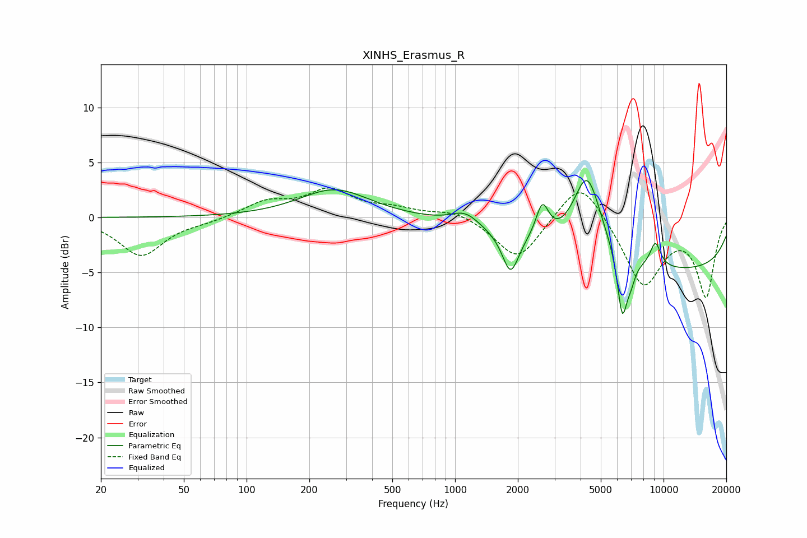

# XINHS_Erasmus_R
See [usage instructions](https://github.com/jaakkopasanen/AutoEq#usage) for more options and info.

### Parametric EQs
Apply preamp of -3.5 dB when using parametric equalizer.

|   # | Type    |   Fc (Hz) |    Q |   Gain (dB) |
|-----|---------|-----------|------|-------------|
|   1 | Peaking |       264 | 0.85 |         2.6 |
|   2 | Peaking |      1112 | 3.24 |        -0.2 |
|   3 | Peaking |      1118 | 2.24 |         1.4 |
|   4 | Peaking |      1845 | 3.63 |        -3.7 |
|   5 | Peaking |      2621 | 4.59 |         3.1 |
|   6 | Peaking |      4301 | 2.01 |         7.5 |
|   7 | Peaking |      6337 | 5.8  |        -5.6 |
|   8 | Peaking |      6958 | 5.97 |        -1.4 |
|   9 | Peaking |      9140 | 4.84 |         2.3 |
|  10 | Peaking |     10000 | 0.18 |        -4.8 |

### Fixed Band EQs
When using fixed band (also called graphic) equalizer, apply preamp of **-2.8 dB** (if available) and set gains manually with these parameters.

|   # | Type    |   Fc (Hz) |    Q |   Gain (dB) |
|-----|---------|-----------|------|-------------|
|   1 | Peaking |        31 | 1.41 |        -3.5 |
|   2 | Peaking |        62 | 1.41 |        -0.3 |
|   3 | Peaking |       125 | 1.41 |         1.4 |
|   4 | Peaking |       250 | 1.41 |         2.4 |
|   5 | Peaking |       500 | 1.41 |         0.7 |
|   6 | Peaking |      1000 | 1.41 |         0.7 |
|   7 | Peaking |      2000 | 1.41 |        -4   |
|   8 | Peaking |      4000 | 1.41 |         3.9 |
|   9 | Peaking |      8000 | 1.41 |        -6.2 |
|  10 | Peaking |     16000 | 1.41 |        -7   |

### Graphs

