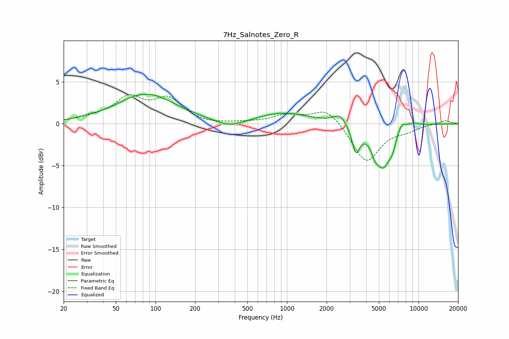

# 7Hz_Salnotes_Zero_R
See [usage instructions](https://github.com/jaakkopasanen/AutoEq#usage) for more options and info.

### Parametric EQs
Apply preamp of -3.6 dB when using parametric equalizer.

|   # | Type    |   Fc (Hz) |    Q |   Gain (dB) |
|-----|---------|-----------|------|-------------|
|   1 | Peaking |        85 | 0.64 |         3.5 |
|   2 | Peaking |       372 | 1.23 |        -0.9 |
|   3 | Peaking |       930 | 0.68 |         1.3 |
|   4 | Peaking |      2534 | 2.85 |         1.2 |
|   5 | Peaking |      3340 | 4.69 |        -3   |
|   6 | Peaking |      4644 | 6    |        -0.8 |
|   7 | Peaking |      5359 | 2.05 |        -5.1 |
|   8 | Peaking |      6356 | 5.82 |        -1   |
|   9 | Peaking |      7424 | 3.71 |         1.2 |
|  10 | Peaking |      9195 | 2.64 |         0.4 |

### Fixed Band EQs
When using fixed band (also called graphic) equalizer, apply preamp of **-3.6 dB** (if available) and set gains manually with these parameters.

|   # | Type    |   Fc (Hz) |    Q |   Gain (dB) |
|-----|---------|-----------|------|-------------|
|   1 | Peaking |        31 | 1.41 |         0.6 |
|   2 | Peaking |        62 | 1.41 |         2.9 |
|   3 | Peaking |       125 | 1.41 |         2.7 |
|   4 | Peaking |       250 | 1.41 |        -0.1 |
|   5 | Peaking |       500 | 1.41 |         0.1 |
|   6 | Peaking |      1000 | 1.41 |         1   |
|   7 | Peaking |      2000 | 1.41 |         1.9 |
|   8 | Peaking |      4000 | 1.41 |        -4.6 |
|   9 | Peaking |      8000 | 1.41 |        -0.6 |
|  10 | Peaking |     16000 | 1.41 |         0.4 |

### Graphs

