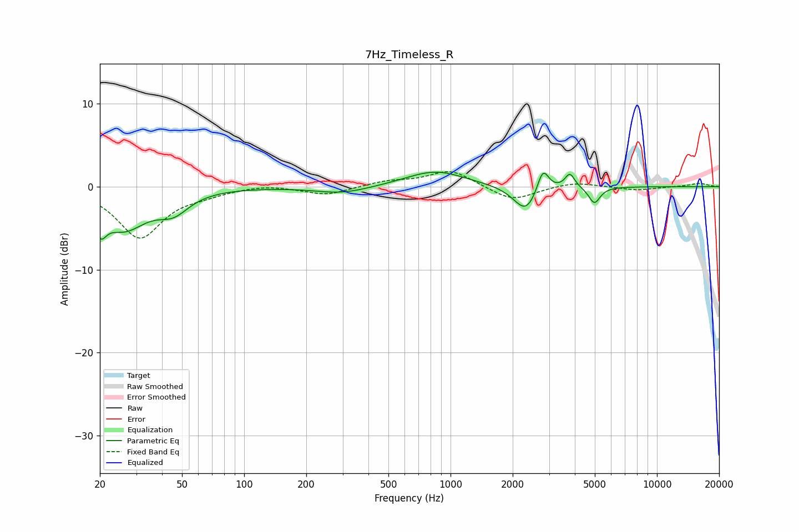

# 7Hz_Timeless_R
See [usage instructions](https://github.com/jaakkopasanen/AutoEq#usage) for more options and info.

### Parametric EQs
Apply preamp of -1.8 dB when using parametric equalizer.

|   # | Type    |   Fc (Hz) |    Q |   Gain (dB) |
|-----|---------|-----------|------|-------------|
|   1 | Peaking |        20 | 5.95 |         2.7 |
|   2 | Peaking |        20 | 5.46 |        -5.5 |
|   3 | Peaking |        26 | 1.25 |        -4.7 |
|   4 | Peaking |        45 | 1.88 |        -2.2 |
|   5 | Peaking |       300 | 1.08 |        -0.9 |
|   6 | Peaking |       843 | 0.99 |         1.9 |
|   7 | Peaking |      2320 | 2.42 |        -3.2 |
|   8 | Peaking |      2801 | 4.99 |         3   |
|   9 | Peaking |      3786 | 6    |         1.7 |
|  10 | Peaking |      4977 | 5.17 |        -2   |

### Fixed Band EQs
When using fixed band (also called graphic) equalizer, apply preamp of **-1.9 dB** (if available) and set gains manually with these parameters.

|   # | Type    |   Fc (Hz) |    Q |   Gain (dB) |
|-----|---------|-----------|------|-------------|
|   1 | Peaking |        31 | 1.41 |        -6.1 |
|   2 | Peaking |        62 | 1.41 |        -0.6 |
|   3 | Peaking |       125 | 1.41 |         0.3 |
|   4 | Peaking |       250 | 1.41 |        -1   |
|   5 | Peaking |       500 | 1.41 |         0.6 |
|   6 | Peaking |      1000 | 1.41 |         2   |
|   7 | Peaking |      2000 | 1.41 |        -1.8 |
|   8 | Peaking |      4000 | 1.41 |         0.6 |
|   9 | Peaking |      8000 | 1.41 |        -0.4 |
|  10 | Peaking |     16000 | 1.41 |         0.4 |

### Graphs

