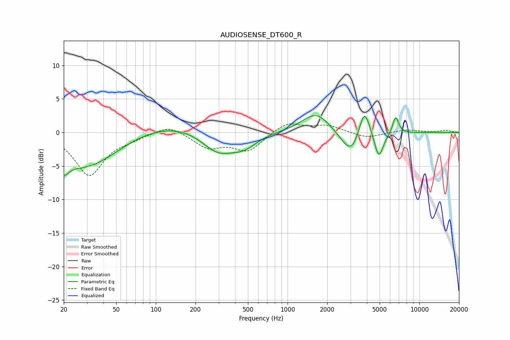

# AUDIOSENSE_DT600_R
See [usage instructions](https://github.com/jaakkopasanen/AutoEq#usage) for more options and info.

### Parametric EQs
Apply preamp of -2.6 dB when using parametric equalizer.

|   # | Type    |   Fc (Hz) |    Q |   Gain (dB) |
|-----|---------|-----------|------|-------------|
|   1 | Peaking |        20 | 3.65 |        -2.1 |
|   2 | Peaking |        30 | 0.54 |        -5.6 |
|   3 | Peaking |       129 | 0.34 |         2   |
|   4 | Peaking |       298 | 1.06 |        -3.7 |
|   5 | Peaking |       472 | 1.47 |        -1.8 |
|   6 | Peaking |      1649 | 1.31 |         3.1 |
|   7 | Peaking |      3060 | 1.84 |        -4   |
|   8 | Peaking |      3819 | 3.23 |         4.9 |
|   9 | Peaking |      4924 | 4.05 |        -3.9 |
|  10 | Peaking |      6614 | 5.93 |         2.6 |

### Fixed Band EQs
When using fixed band (also called graphic) equalizer, apply preamp of **-1.4 dB** (if available) and set gains manually with these parameters.

|   # | Type    |   Fc (Hz) |    Q |   Gain (dB) |
|-----|---------|-----------|------|-------------|
|   1 | Peaking |        31 | 1.41 |        -6.3 |
|   2 | Peaking |        62 | 1.41 |        -0.7 |
|   3 | Peaking |       125 | 1.41 |         1.3 |
|   4 | Peaking |       250 | 1.41 |        -2.1 |
|   5 | Peaking |       500 | 1.41 |        -2.7 |
|   6 | Peaking |      1000 | 1.41 |         1.6 |
|   7 | Peaking |      2000 | 1.41 |         1   |
|   8 | Peaking |      4000 | 1.41 |        -0.9 |
|   9 | Peaking |      8000 | 1.41 |         0.4 |
|  10 | Peaking |     16000 | 1.41 |         0.3 |

### Graphs

