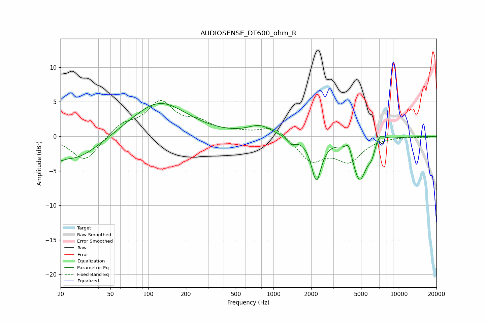

# AUDIOSENSE_DT600_ohm_R
See [usage instructions](https://github.com/jaakkopasanen/AutoEq#usage) for more options and info.

### Parametric EQs
Apply preamp of -4.9 dB when using parametric equalizer.

|   # | Type    |   Fc (Hz) |    Q |   Gain (dB) |
|-----|---------|-----------|------|-------------|
|   1 | Peaking |        20 | 5.08 |        -0.7 |
|   2 | Peaking |        26 | 0.73 |        -3.6 |
|   3 | Peaking |       122 | 0.65 |         5   |
|   4 | Peaking |       781 | 1.51 |         1.4 |
|   5 | Peaking |      1391 | 4.32 |        -1   |
|   6 | Peaking |      2202 | 3.57 |        -6.1 |
|   7 | Peaking |      3985 | 5.66 |         1.8 |
|   8 | Peaking |      4860 | 2.41 |        -6.3 |
|   9 | Peaking |      6071 | 5    |        -1.5 |
|  10 | Peaking |      7044 | 3.42 |         1.4 |

### Fixed Band EQs
When using fixed band (also called graphic) equalizer, apply preamp of **-5.3 dB** (if available) and set gains manually with these parameters.

|   # | Type    |   Fc (Hz) |    Q |   Gain (dB) |
|-----|---------|-----------|------|-------------|
|   1 | Peaking |        31 | 1.41 |        -3.7 |
|   2 | Peaking |        62 | 1.41 |         1.7 |
|   3 | Peaking |       125 | 1.41 |         4.7 |
|   4 | Peaking |       250 | 1.41 |         1.7 |
|   5 | Peaking |       500 | 1.41 |         0.5 |
|   6 | Peaking |      1000 | 1.41 |         1.6 |
|   7 | Peaking |      2000 | 1.41 |        -3.5 |
|   8 | Peaking |      4000 | 1.41 |        -3.3 |
|   9 | Peaking |      8000 | 1.41 |        -0   |
|  10 | Peaking |     16000 | 1.41 |        -0.2 |

### Graphs

