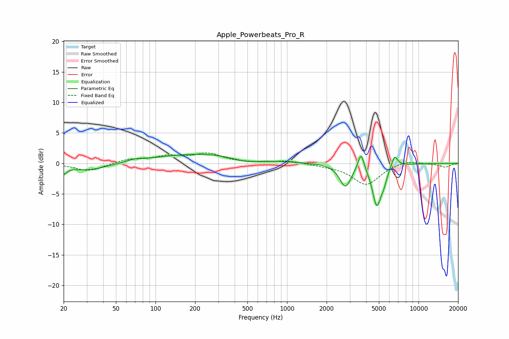

# Apple_Powerbeats_Pro_R
See [usage instructions](https://github.com/jaakkopasanen/AutoEq#usage) for more options and info.

### Parametric EQs
Apply preamp of -1.6 dB when using parametric equalizer.

|   # | Type    |   Fc (Hz) |    Q |   Gain (dB) |
|-----|---------|-----------|------|-------------|
|   1 | Peaking |        20 | 5.89 |        -1.2 |
|   2 | Peaking |        30 | 0.98 |        -1.2 |
|   3 | Peaking |        70 | 2.55 |         0.3 |
|   4 | Peaking |       231 | 0.38 |         1.6 |
|   5 | Peaking |       483 | 1.33 |        -0.8 |
|   6 | Peaking |      2778 | 3.25 |        -3.7 |
|   7 | Peaking |      3654 | 6    |         3   |
|   8 | Peaking |      4816 | 4.09 |        -6.6 |
|   9 | Peaking |      5459 | 6    |        -1.5 |
|  10 | Peaking |      6583 | 5.83 |         1.9 |

### Fixed Band EQs
When using fixed band (also called graphic) equalizer, apply preamp of **-1.8 dB** (if available) and set gains manually with these parameters.

|   # | Type    |   Fc (Hz) |    Q |   Gain (dB) |
|-----|---------|-----------|------|-------------|
|   1 | Peaking |        31 | 1.41 |        -1.3 |
|   2 | Peaking |        62 | 1.41 |         0.6 |
|   3 | Peaking |       125 | 1.41 |         1   |
|   4 | Peaking |       250 | 1.41 |         1.5 |
|   5 | Peaking |       500 | 1.41 |         0   |
|   6 | Peaking |      1000 | 1.41 |         0.5 |
|   7 | Peaking |      2000 | 1.41 |        -0.3 |
|   8 | Peaking |      4000 | 1.41 |        -3.5 |
|   9 | Peaking |      8000 | 1.41 |         0.6 |
|  10 | Peaking |     16000 | 1.41 |        -0.6 |

### Graphs

