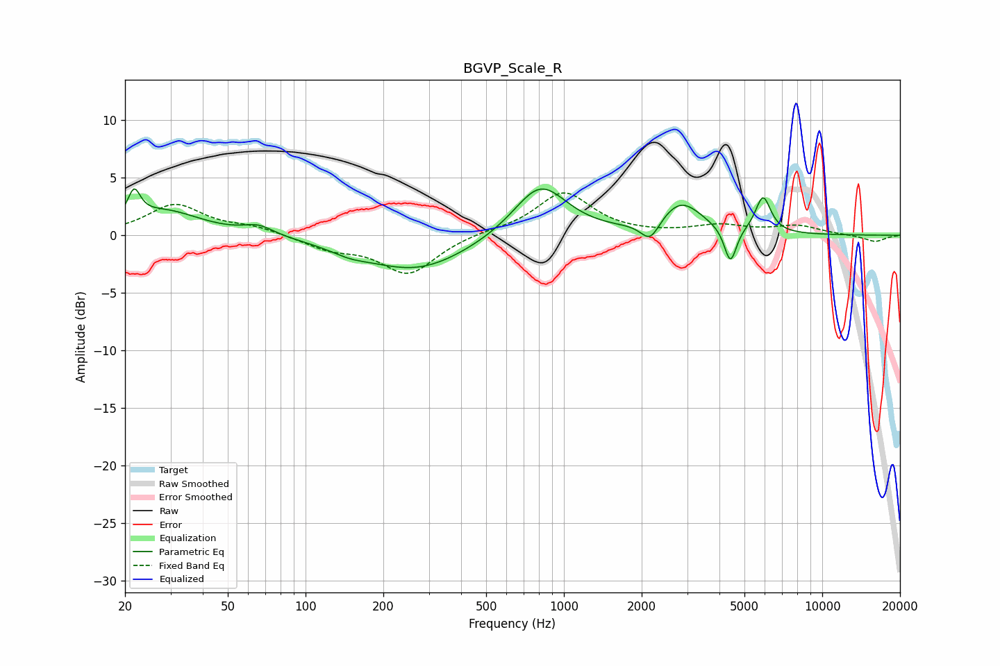

# BGVP_Scale_R
See [usage instructions](https://github.com/jaakkopasanen/AutoEq#usage) for more options and info.

### Parametric EQs
Apply preamp of -4.1 dB when using parametric equalizer.

|   # | Type    |   Fc (Hz) |    Q |   Gain (dB) |
|-----|---------|-----------|------|-------------|
|   1 | Peaking |        22 | 5.96 |         2.4 |
|   2 | Peaking |        28 | 0.98 |         2.1 |
|   3 | Peaking |        66 | 2.49 |         0.8 |
|   4 | Peaking |       148 | 1.87 |        -0.5 |
|   5 | Peaking |       269 | 0.7  |        -3.1 |
|   6 | Peaking |       810 | 1.36 |         4.6 |
|   7 | Peaking |      2159 | 3.85 |        -1.8 |
|   8 | Peaking |      2837 | 1.71 |         2.8 |
|   9 | Peaking |      4411 | 6    |        -3.2 |
|  10 | Peaking |      5903 | 4.68 |         3.2 |

### Fixed Band EQs
When using fixed band (also called graphic) equalizer, apply preamp of **-3.8 dB** (if available) and set gains manually with these parameters.

|   # | Type    |   Fc (Hz) |    Q |   Gain (dB) |
|-----|---------|-----------|------|-------------|
|   1 | Peaking |        31 | 1.41 |         2.6 |
|   2 | Peaking |        62 | 1.41 |         0.6 |
|   3 | Peaking |       125 | 1.41 |        -1.1 |
|   4 | Peaking |       250 | 1.41 |        -3.3 |
|   5 | Peaking |       500 | 1.41 |         0.3 |
|   6 | Peaking |      1000 | 1.41 |         3.7 |
|   7 | Peaking |      2000 | 1.41 |         0   |
|   8 | Peaking |      4000 | 1.41 |         0.8 |
|   9 | Peaking |      8000 | 1.41 |         0.8 |
|  10 | Peaking |     16000 | 1.41 |        -0.6 |

### Graphs

