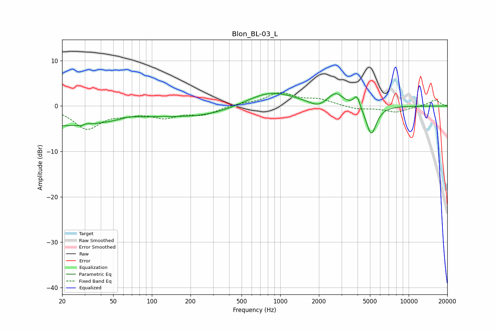

# Blon_BL-03_L
See [usage instructions](https://github.com/jaakkopasanen/AutoEq#usage) for more options and info.

### Parametric EQs
Apply preamp of -2.9 dB when using parametric equalizer.

|   # | Type    |   Fc (Hz) |    Q |   Gain (dB) |
|-----|---------|-----------|------|-------------|
|   1 | Peaking |        20 | 0.3  |        -4.3 |
|   2 | Peaking |        29 | 5.78 |        -3.5 |
|   3 | Peaking |        29 | 5.42 |         3.5 |
|   4 | Peaking |        67 | 2.2  |         0.5 |
|   5 | Peaking |       241 | 0.48 |        -2.2 |
|   6 | Peaking |       834 | 0.73 |         3.5 |
|   7 | Peaking |      1968 | 2.22 |        -1.3 |
|   8 | Peaking |      2698 | 2.38 |         2.7 |
|   9 | Peaking |      3953 | 5.94 |         2.6 |
|  10 | Peaking |      5116 | 3.48 |        -6.5 |

### Fixed Band EQs
When using fixed band (also called graphic) equalizer, apply preamp of **-3.0 dB** (if available) and set gains manually with these parameters.

|   # | Type    |   Fc (Hz) |    Q |   Gain (dB) |
|-----|---------|-----------|------|-------------|
|   1 | Peaking |        31 | 1.41 |        -4.8 |
|   2 | Peaking |        62 | 1.41 |        -1.2 |
|   3 | Peaking |       125 | 1.41 |        -2.2 |
|   4 | Peaking |       250 | 1.41 |        -1.7 |
|   5 | Peaking |       500 | 1.41 |         0.5 |
|   6 | Peaking |      1000 | 1.41 |         2.7 |
|   7 | Peaking |      2000 | 1.41 |         1.3 |
|   8 | Peaking |      4000 | 1.41 |        -0.7 |
|   9 | Peaking |      8000 | 1.41 |        -1.3 |
|  10 | Peaking |     16000 | 1.41 |         1.4 |

### Graphs

