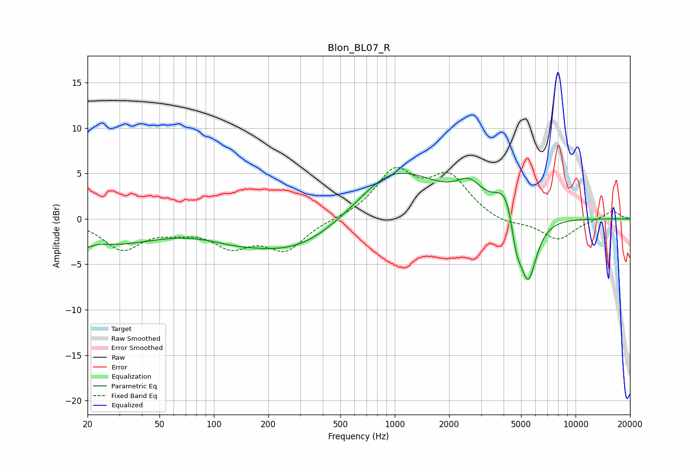

# Blon_BL07_R
See [usage instructions](https://github.com/jaakkopasanen/AutoEq#usage) for more options and info.

### Parametric EQs
Apply preamp of -5.1 dB when using parametric equalizer.

|   # | Type    |   Fc (Hz) |    Q |   Gain (dB) |
|-----|---------|-----------|------|-------------|
|   1 | Peaking |        20 | 5.36 |        -0.7 |
|   2 | Peaking |        27 | 0.54 |        -2.6 |
|   3 | Peaking |       127 | 0.9  |        -0.8 |
|   4 | Peaking |       310 | 0.49 |        -4.3 |
|   5 | Peaking |       637 | 0.94 |        -0.7 |
|   6 | Peaking |       923 | 0.56 |         6.8 |
|   7 | Peaking |      2582 | 2.04 |         2.2 |
|   8 | Peaking |      4171 | 2.36 |         3.8 |
|   9 | Peaking |      4690 | 4.9  |        -3.4 |
|  10 | Peaking |      5454 | 2.84 |        -7.7 |

### Fixed Band EQs
When using fixed band (also called graphic) equalizer, apply preamp of **-5.7 dB** (if available) and set gains manually with these parameters.

|   # | Type    |   Fc (Hz) |    Q |   Gain (dB) |
|-----|---------|-----------|------|-------------|
|   1 | Peaking |        31 | 1.41 |        -3.2 |
|   2 | Peaking |        62 | 1.41 |        -0.8 |
|   3 | Peaking |       125 | 1.41 |        -2.7 |
|   4 | Peaking |       250 | 1.41 |        -3.2 |
|   5 | Peaking |       500 | 1.41 |        -0   |
|   6 | Peaking |      1000 | 1.41 |         5   |
|   7 | Peaking |      2000 | 1.41 |         4.3 |
|   8 | Peaking |      4000 | 1.41 |        -0.7 |
|   9 | Peaking |      8000 | 1.41 |        -2.3 |
|  10 | Peaking |     16000 | 1.41 |         0.9 |

### Graphs

