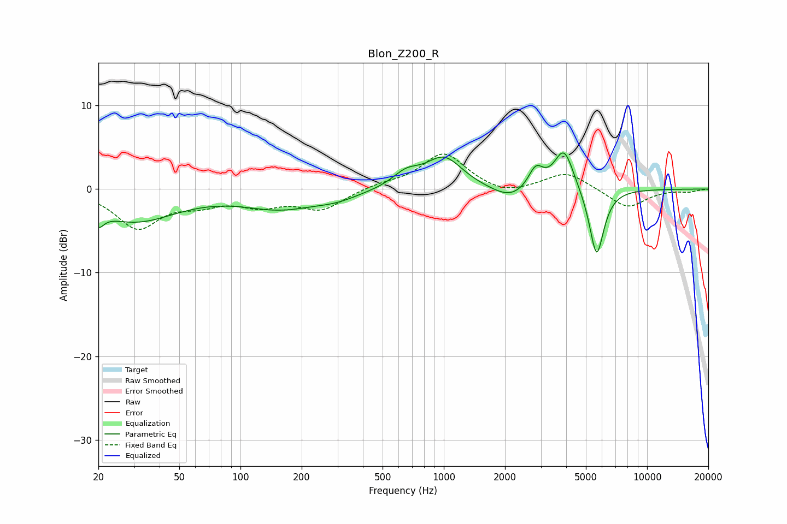

# Blon_Z200_R
See [usage instructions](https://github.com/jaakkopasanen/AutoEq#usage) for more options and info.

### Parametric EQs
Apply preamp of -4.4 dB when using parametric equalizer.

|   # | Type    |   Fc (Hz) |    Q |   Gain (dB) |
|-----|---------|-----------|------|-------------|
|   1 | Peaking |        20 | 5.36 |        -1.7 |
|   2 | Peaking |        30 | 0.68 |        -3.8 |
|   3 | Peaking |       157 | 0.77 |        -2.1 |
|   4 | Peaking |       297 | 1.29 |        -0.8 |
|   5 | Peaking |       652 | 2.1  |         1.6 |
|   6 | Peaking |      1003 | 1.56 |         3.7 |
|   7 | Peaking |      2132 | 1.53 |        -1.5 |
|   8 | Peaking |      2833 | 3.84 |         2.6 |
|   9 | Peaking |      3901 | 2.92 |         5   |
|  10 | Peaking |      5645 | 3.84 |        -8.3 |

### Fixed Band EQs
When using fixed band (also called graphic) equalizer, apply preamp of **-4.3 dB** (if available) and set gains manually with these parameters.

|   # | Type    |   Fc (Hz) |    Q |   Gain (dB) |
|-----|---------|-----------|------|-------------|
|   1 | Peaking |        31 | 1.41 |        -4.5 |
|   2 | Peaking |        62 | 1.41 |        -1.4 |
|   3 | Peaking |       125 | 1.41 |        -1.7 |
|   4 | Peaking |       250 | 1.41 |        -2.3 |
|   5 | Peaking |       500 | 1.41 |         0.5 |
|   6 | Peaking |      1000 | 1.41 |         4.3 |
|   7 | Peaking |      2000 | 1.41 |        -0.9 |
|   8 | Peaking |      4000 | 1.41 |         2.1 |
|   9 | Peaking |      8000 | 1.41 |        -2.3 |
|  10 | Peaking |     16000 | 1.41 |        -0.3 |

### Graphs

