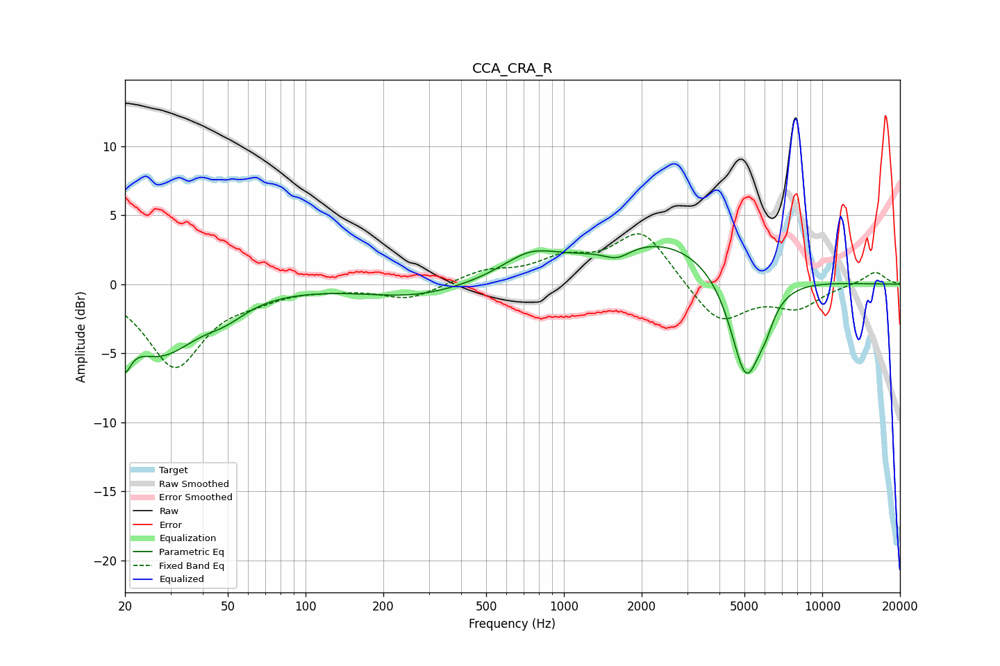

# CCA_CRA_R
See [usage instructions](https://github.com/jaakkopasanen/AutoEq#usage) for more options and info.

### Parametric EQs
Apply preamp of -2.8 dB when using parametric equalizer.

|   # | Type    |   Fc (Hz) |    Q |   Gain (dB) |
|-----|---------|-----------|------|-------------|
|   1 | Peaking |        20 | 5.76 |        -5.4 |
|   2 | Peaking |        20 | 5.99 |         2.7 |
|   3 | Peaking |        27 | 0.94 |        -4.8 |
|   4 | Peaking |        49 | 1.74 |        -0.9 |
|   5 | Peaking |       266 | 0.71 |        -0.9 |
|   6 | Peaking |       740 | 1.29 |         1.6 |
|   7 | Peaking |      1606 | 2.63 |        -0.9 |
|   8 | Peaking |      2444 | 0.5  |         3.4 |
|   9 | Peaking |      5073 | 2.21 |        -8.1 |
|  10 | Peaking |      6048 | 4.51 |        -1   |

### Fixed Band EQs
When using fixed band (also called graphic) equalizer, apply preamp of **-3.7 dB** (if available) and set gains manually with these parameters.

|   # | Type    |   Fc (Hz) |    Q |   Gain (dB) |
|-----|---------|-----------|------|-------------|
|   1 | Peaking |        31 | 1.41 |        -5.9 |
|   2 | Peaking |        62 | 1.41 |        -0.7 |
|   3 | Peaking |       125 | 1.41 |        -0.2 |
|   4 | Peaking |       250 | 1.41 |        -1.1 |
|   5 | Peaking |       500 | 1.41 |         0.9 |
|   6 | Peaking |      1000 | 1.41 |         1.5 |
|   7 | Peaking |      2000 | 1.41 |         3.9 |
|   8 | Peaking |      4000 | 1.41 |        -2.9 |
|   9 | Peaking |      8000 | 1.41 |        -1.6 |
|  10 | Peaking |     16000 | 1.41 |         0.9 |

### Graphs

