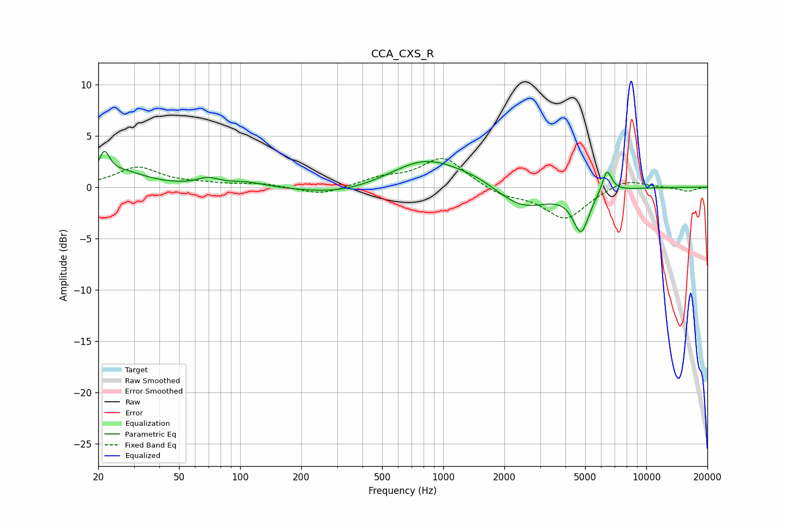

# CCA_CXS_R
See [usage instructions](https://github.com/jaakkopasanen/AutoEq#usage) for more options and info.

### Parametric EQs
Apply preamp of -3.6 dB when using parametric equalizer.

|   # | Type    |   Fc (Hz) |    Q |   Gain (dB) |
|-----|---------|-----------|------|-------------|
|   1 | Peaking |        21 | 5.46 |         2.3 |
|   2 | Peaking |        26 | 1.23 |         1.4 |
|   3 | Peaking |        69 | 2.67 |         0.7 |
|   4 | Peaking |       107 | 1.59 |         0.5 |
|   5 | Peaking |       313 | 0.72 |        -0.9 |
|   6 | Peaking |       816 | 0.82 |         2.8 |
|   7 | Peaking |      1455 | 1.16 |         0.7 |
|   8 | Peaking |      2450 | 1.05 |        -2.3 |
|   9 | Peaking |      4771 | 3.52 |        -4   |
|  10 | Peaking |      6408 | 5.79 |         2.3 |

### Fixed Band EQs
When using fixed band (also called graphic) equalizer, apply preamp of **-2.9 dB** (if available) and set gains manually with these parameters.

|   # | Type    |   Fc (Hz) |    Q |   Gain (dB) |
|-----|---------|-----------|------|-------------|
|   1 | Peaking |        31 | 1.41 |         1.9 |
|   2 | Peaking |        62 | 1.41 |         0.2 |
|   3 | Peaking |       125 | 1.41 |         0.3 |
|   4 | Peaking |       250 | 1.41 |        -0.8 |
|   5 | Peaking |       500 | 1.41 |         0.8 |
|   6 | Peaking |      1000 | 1.41 |         2.9 |
|   7 | Peaking |      2000 | 1.41 |        -0.8 |
|   8 | Peaking |      4000 | 1.41 |        -3.1 |
|   9 | Peaking |      8000 | 1.41 |         0.9 |
|  10 | Peaking |     16000 | 1.41 |        -0.4 |

### Graphs

