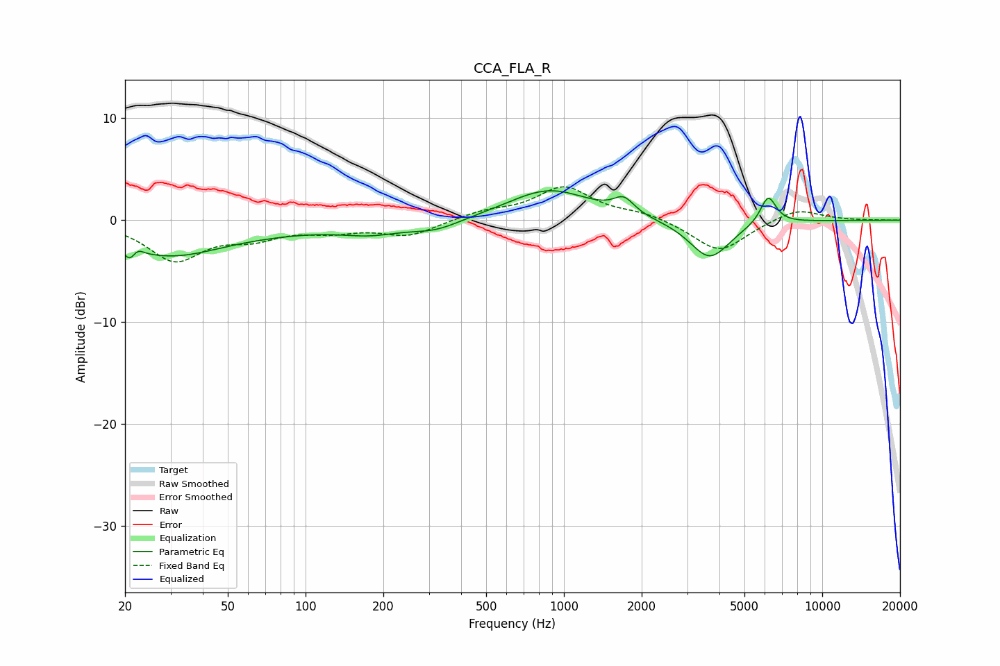

# CCA_FLA_R
See [usage instructions](https://github.com/jaakkopasanen/AutoEq#usage) for more options and info.

### Parametric EQs
Apply preamp of -3.0 dB when using parametric equalizer.

|   # | Type    |   Fc (Hz) |    Q |   Gain (dB) |
|-----|---------|-----------|------|-------------|
|   1 | Peaking |        21 | 4.83 |        -3.3 |
|   2 | Peaking |        22 | 5.54 |         2.7 |
|   3 | Peaking |        29 | 0.72 |        -3   |
|   4 | Peaking |        69 | 0.49 |        -0.7 |
|   5 | Peaking |       179 | 1.19 |        -0.9 |
|   6 | Peaking |       319 | 1.42 |        -1   |
|   7 | Peaking |       877 | 0.89 |         3   |
|   8 | Peaking |      1706 | 3.58 |         1.5 |
|   9 | Peaking |      3667 | 1.8  |        -3.8 |
|  10 | Peaking |      6177 | 4.47 |         2.8 |

### Fixed Band EQs
When using fixed band (also called graphic) equalizer, apply preamp of **-3.4 dB** (if available) and set gains manually with these parameters.

|   # | Type    |   Fc (Hz) |    Q |   Gain (dB) |
|-----|---------|-----------|------|-------------|
|   1 | Peaking |        31 | 1.41 |        -3.8 |
|   2 | Peaking |        62 | 1.41 |        -1.4 |
|   3 | Peaking |       125 | 1.41 |        -0.9 |
|   4 | Peaking |       250 | 1.41 |        -1.5 |
|   5 | Peaking |       500 | 1.41 |         0.8 |
|   6 | Peaking |      1000 | 1.41 |         3.2 |
|   7 | Peaking |      2000 | 1.41 |         0.7 |
|   8 | Peaking |      4000 | 1.41 |        -3.2 |
|   9 | Peaking |      8000 | 1.41 |         1.2 |
|  10 | Peaking |     16000 | 1.41 |        -0   |

### Graphs

