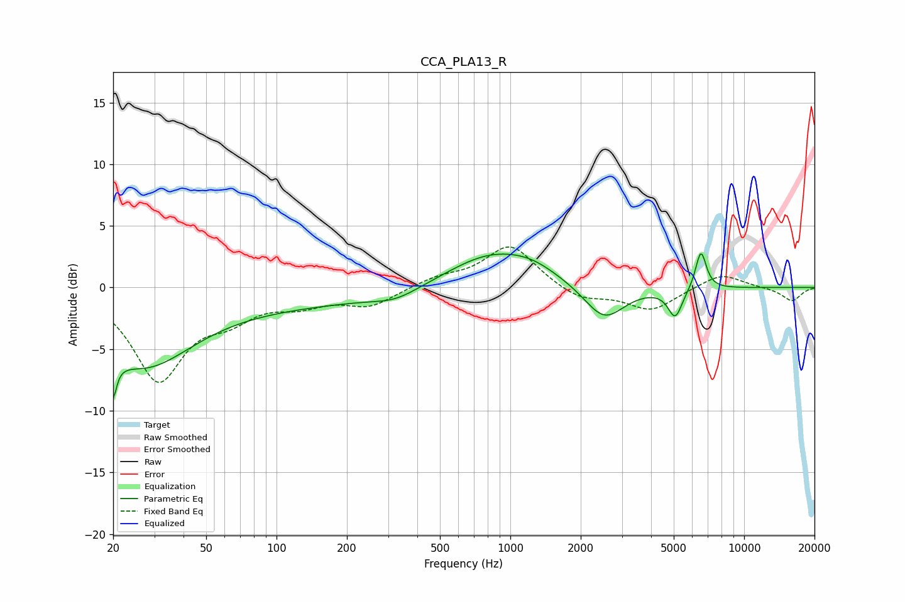

# CCA_PLA13_R
See [usage instructions](https://github.com/jaakkopasanen/AutoEq#usage) for more options and info.

### Parametric EQs
Apply preamp of -2.8 dB when using parametric equalizer.

|   # | Type    |   Fc (Hz) |    Q |   Gain (dB) |
|-----|---------|-----------|------|-------------|
|   1 | Peaking |        20 | 5.85 |        -6.8 |
|   2 | Peaking |        20 | 5.87 |         3.3 |
|   3 | Peaking |        27 | 0.71 |        -5.2 |
|   4 | Peaking |        79 | 0.2  |        -1.4 |
|   5 | Peaking |       323 | 1.46 |        -0.7 |
|   6 | Peaking |       822 | 0.74 |         2.7 |
|   7 | Peaking |      1241 | 1.26 |         0.8 |
|   8 | Peaking |      2521 | 1.65 |        -2.9 |
|   9 | Peaking |      5073 | 4.58 |        -2.3 |
|  10 | Peaking |      6533 | 5.95 |         3.1 |

### Fixed Band EQs
When using fixed band (also called graphic) equalizer, apply preamp of **-3.4 dB** (if available) and set gains manually with these parameters.

|   # | Type    |   Fc (Hz) |    Q |   Gain (dB) |
|-----|---------|-----------|------|-------------|
|   1 | Peaking |        31 | 1.41 |        -7.3 |
|   2 | Peaking |        62 | 1.41 |        -1.9 |
|   3 | Peaking |       125 | 1.41 |        -1.1 |
|   4 | Peaking |       250 | 1.41 |        -1.4 |
|   5 | Peaking |       500 | 1.41 |         0.7 |
|   6 | Peaking |      1000 | 1.41 |         3.5 |
|   7 | Peaking |      2000 | 1.41 |        -1.1 |
|   8 | Peaking |      4000 | 1.41 |        -1.8 |
|   9 | Peaking |      8000 | 1.41 |         1.2 |
|  10 | Peaking |     16000 | 1.41 |        -1.1 |

### Graphs

