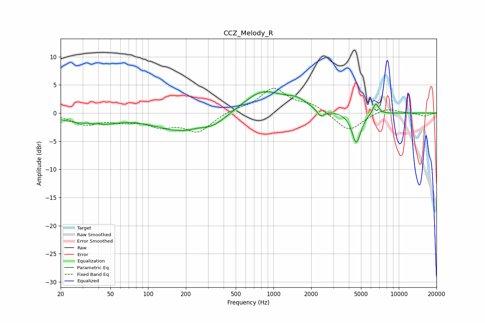

# CCZ_Melody_R
See [usage instructions](https://github.com/jaakkopasanen/AutoEq#usage) for more options and info.

### Parametric EQs
Apply preamp of -3.9 dB when using parametric equalizer.

|   # | Type    |   Fc (Hz) |    Q |   Gain (dB) |
|-----|---------|-----------|------|-------------|
|   1 | Peaking |        26 | 1.02 |        -1.2 |
|   2 | Peaking |        46 | 1.29 |        -1   |
|   3 | Peaking |       198 | 0.59 |        -3.4 |
|   4 | Peaking |       245 | 2.01 |         0.3 |
|   5 | Peaking |       338 | 1.65 |        -0.9 |
|   6 | Peaking |       820 | 0.87 |         4.1 |
|   7 | Peaking |      1539 | 1.73 |         1.4 |
|   8 | Peaking |      2383 | 4.78 |        -1.3 |
|   9 | Peaking |      4587 | 3.89 |        -5.4 |
|  10 | Peaking |      6546 | 6    |         2   |

### Fixed Band EQs
When using fixed band (also called graphic) equalizer, apply preamp of **-4.5 dB** (if available) and set gains manually with these parameters.

|   # | Type    |   Fc (Hz) |    Q |   Gain (dB) |
|-----|---------|-----------|------|-------------|
|   1 | Peaking |        31 | 1.41 |        -1.9 |
|   2 | Peaking |        62 | 1.41 |        -1.1 |
|   3 | Peaking |       125 | 1.41 |        -2   |
|   4 | Peaking |       250 | 1.41 |        -3.2 |
|   5 | Peaking |       500 | 1.41 |         0.6 |
|   6 | Peaking |      1000 | 1.41 |         4.3 |
|   7 | Peaking |      2000 | 1.41 |         1.4 |
|   8 | Peaking |      4000 | 1.41 |        -3.3 |
|   9 | Peaking |      8000 | 1.41 |         1   |
|  10 | Peaking |     16000 | 1.41 |        -0.6 |

### Graphs

