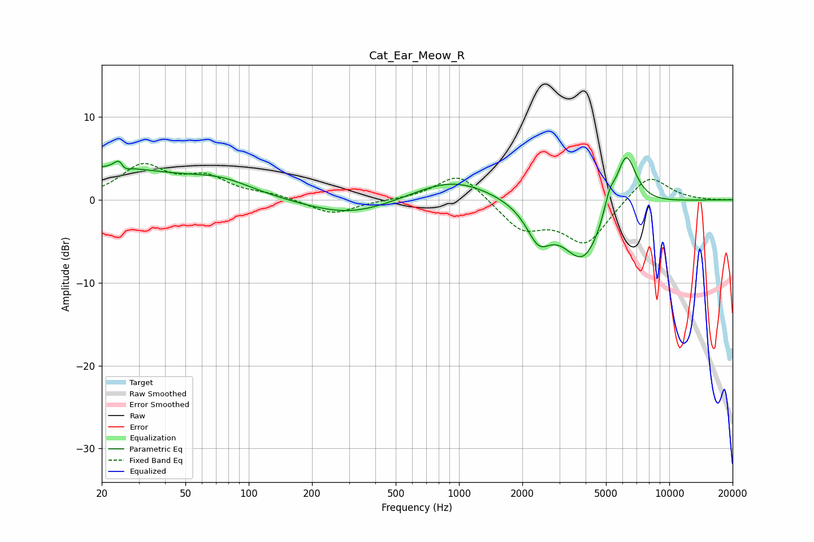

# Cat_Ear_Meow_R
See [usage instructions](https://github.com/jaakkopasanen/AutoEq#usage) for more options and info.

### Parametric EQs
Apply preamp of -5.2 dB when using parametric equalizer.

|   # | Type    |   Fc (Hz) |    Q |   Gain (dB) |
|-----|---------|-----------|------|-------------|
|   1 | Peaking |        20 | 0.38 |         3.7 |
|   2 | Peaking |        25 | 5.81 |         3.2 |
|   3 | Peaking |        25 | 5.92 |        -2.7 |
|   4 | Peaking |        74 | 0.94 |         1.5 |
|   5 | Peaking |       304 | 0.67 |        -2   |
|   6 | Peaking |       935 | 0.74 |         2.7 |
|   7 | Peaking |      2390 | 2.45 |        -3.9 |
|   8 | Peaking |      3904 | 1.38 |        -7.5 |
|   9 | Peaking |      5194 | 5.03 |         2.4 |
|  10 | Peaking |      6222 | 2.74 |         7.1 |

### Fixed Band EQs
When using fixed band (also called graphic) equalizer, apply preamp of **-4.5 dB** (if available) and set gains manually with these parameters.

|   # | Type    |   Fc (Hz) |    Q |   Gain (dB) |
|-----|---------|-----------|------|-------------|
|   1 | Peaking |        31 | 1.41 |         3.9 |
|   2 | Peaking |        62 | 1.41 |         2.4 |
|   3 | Peaking |       125 | 1.41 |         0.5 |
|   4 | Peaking |       250 | 1.41 |        -1.8 |
|   5 | Peaking |       500 | 1.41 |        -0   |
|   6 | Peaking |      1000 | 1.41 |         3.4 |
|   7 | Peaking |      2000 | 1.41 |        -3.4 |
|   8 | Peaking |      4000 | 1.41 |        -5.2 |
|   9 | Peaking |      8000 | 1.41 |         3.3 |
|  10 | Peaking |     16000 | 1.41 |        -0   |

### Graphs

